- [AZ-104 Microsoft Azure Administrator Certification Prep](#az-104-microsoft-azure-administrator-certification-prep)
- [Azure Administration](#azure-administration)
  - [Understanding Azure Resource Manager](#understanding-azure-resource-manager)
    - [azure cloud fundamentals](#azure-cloud-fundamentals)
    - [exam tips](#exam-tips)
  - [using azure portal and cloud shell](#using-azure-portal-and-cloud-shell)
    - [describing azure portal](#describing-azure-portal)
    - [components of azure portal](#components-of-azure-portal)
    - [demo of using azure portal](#demo-of-using-azure-portal)
    - [summary](#summary)
  - [using Azure CLI and Powershell](#using-azure-cli-and-powershell)
    - [describing Azure CLI and powershell](#describing-azure-cli-and-powershell)
      - [azure CLI](#azure-cli)
      - [Powershell](#powershell)
    - [demo using cli and powershell](#demo-using-cli-and-powershell)
    - [summary](#summary-1)
  - [Using ARM templates](#using-arm-templates)
    - [what are ARM templates](#what-are-arm-templates)
    - [components of ARM templates](#components-of-arm-templates)
    - [demo using ARMs templates](#demo-using-arms-templates)
    - [summary](#summary-2)
- [governance and compliance](#governance-and-compliance)
  - [Managing Subscriptions](#managing-subscriptions)
    - [describing subscriptions](#describing-subscriptions)
    - [types of subscriptions](#types-of-subscriptions)
    - [subscription naming convention suggestions](#subscription-naming-convention-suggestions)
    - [summary](#summary-3)
  - [using management groups](#using-management-groups)
    - [defining mgmt groups](#defining-mgmt-groups)
    - [understanding hierarchy](#understanding-hierarchy)
    - [scoping influence](#scoping-influence)
    - [demo:](#demo)
    - [summary](#summary-4)
  - [Understanding Azure Policy](#understanding-azure-policy)
    - [define azure policy](#define-azure-policy)
    - [components of an Azure Policy](#components-of-an-azure-policy)
    - [policy example](#policy-example)
    - [demo: policy](#demo-policy)
    - [summary](#summary-5)
  - [tagging resources](#tagging-resources)
    - [describing resource tagging](#describing-resource-tagging)
    - [resource tag assignment hierarchy](#resource-tag-assignment-hierarchy)
    - [demo: tagging resources](#demo-tagging-resources)
    - [summary](#summary-6)
  - [LAB: Add, Remove and Update Tags for Resources in Azure](#lab-add-remove-and-update-tags-for-resources-in-azure)
  - [Logging and moving resources](#logging-and-moving-resources)
    - [describing Resource Locks](#describing-resource-locks)
    - [Types of Resource Locks](#types-of-resource-locks)
    - [Moving Resources](#moving-resources)
    - [Demo: locking and moving resources](#demo-locking-and-moving-resources)
    - [summary](#summary-7)
  - [managing azure costs](#managing-azure-costs)
    - [what impacts cost?](#what-impacts-cost)
    - [cost best practices and tools](#cost-best-practices-and-tools)
    - [demo: using Microsoft Cost Management](#demo-using-microsoft-cost-management)
    - [demo: using pricing calculator](#demo-using-pricing-calculator)
    - [demo: using TCO calc](#demo-using-tco-calc)
    - [summary](#summary-8)
  - [building a cloud governance strategy with azure tool](#building-a-cloud-governance-strategy-with-azure-tool)
    - [Define governance](#define-governance)
    - [planning a cloud staregy](#planning-a-cloud-staregy)
    - [governance services](#governance-services)
    - [summary](#summary-9)
    - [expand knowledge](#expand-knowledge)
- [Identity](#identity)
  - [Identity in Azure](#identity-in-azure)
  - [conceptualizing Entra ID](#conceptualizing-entra-id)
    - [IAM basics](#iam-basics)
    - [what is Entra ID](#what-is-entra-id)
    - [Entra ID Tenant Architecture](#entra-id-tenant-architecture)
      - [creation of Entra ID tenant:](#creation-of-entra-id-tenant)
    - [Entra ID Features](#entra-id-features)
    - [Entra ID versus Legacy AD](#entra-id-versus-legacy-ad)
    - [summary](#summary-10)
  - [managing tenants](#managing-tenants)
    - [planning our organization / designing tenants](#planning-our-organization--designing-tenants)
    - [demo: creating a tenant](#demo-creating-a-tenant)
      - [create a tenant](#create-a-tenant)
    - [summary](#summary-11)
  - [creating and managing users](#creating-and-managing-users)
    - [describing users](#describing-users)
    - [types of users](#types-of-users)
    - [demo: creating a user](#demo-creating-a-user)
    - [demo: managing user properties](#demo-managing-user-properties)
    - [demo: bulk adding users](#demo-bulk-adding-users)
    - [demo: inviting guests](#demo-inviting-guests)
    - [summary](#summary-12)
  - [LAB: Create and Manage Microsoft Entra ID Users in the Portal](#lab-create-and-manage-microsoft-entra-id-users-in-the-portal)
    - [Create Microsoft Entra ID User Accounts](#create-microsoft-entra-id-user-accounts)
    - [Modify a Microsoft Entra ID User Account](#modify-a-microsoft-entra-id-user-account)
    - [Revoke Access to a Microsoft Entra ID User Account](#revoke-access-to-a-microsoft-entra-id-user-account)
    - [Delete a Microsoft Entra ID User Account](#delete-a-microsoft-entra-id-user-account)
  - [LAB:](#lab)
    - [bulk create users](#bulk-create-users)
    - [bulk delete users](#bulk-delete-users)
    - [bulk add group member](#bulk-add-group-member)
  - [creating and managing groups](#creating-and-managing-groups)
    - [describing groups](#describing-groups)
    - [practical use of groups](#practical-use-of-groups)
    - [demo: creating a group](#demo-creating-a-group)
    - [demo: managing group membership](#demo-managing-group-membership)
    - [summary](#summary-13)
  - [LAB: Create a Group and Add a Member in Microsoft Entra ID](#lab-create-a-group-and-add-a-member-in-microsoft-entra-id)
    - [Create a New Microsoft Entra ID Group](#create-a-new-microsoft-entra-id-group)
    - [Add a Microsoft Entra ID User as a Member of the Group](#add-a-microsoft-entra-id-user-as-a-member-of-the-group)
    - [Create a New Microsoft Entra ID User](#create-a-new-microsoft-entra-id-user)
    - [Add a Microsoft Entra ID User as an Owner of the Group](#add-a-microsoft-entra-id-user-as-an-owner-of-the-group)
  - [Creating administrative units](#creating-administrative-units)
    - [describing administrative units](#describing-administrative-units)
    - [business use case for adminsitrative units](#business-use-case-for-adminsitrative-units)
    - [demo: creating administrative units](#demo-creating-administrative-units)
    - [summary](#summary-14)
  - [configure self-service password reset (SSPR)](#configure-self-service-password-reset-sspr)
    - [describing SSPR](#describing-sspr)
    - [SSPR Process](#sspr-process)
    - [auth methods when using SSPR](#auth-methods-when-using-sspr)
    - [SSPR considerations](#sspr-considerations)
    - [demo: setting up SSPR](#demo-setting-up-sspr)
    - [summary](#summary-15)
  - [Entra ID Device management](#entra-id-device-management)
    - [basics of device identity](#basics-of-device-identity)
    - [registration options](#registration-options)
    - [demo: managing devices](#demo-managing-devices)
    - [summary](#summary-16)
  - [identity summary](#identity-summary)
- [Role-based access control (RBAC)](#role-based-access-control-rbac)
  - [understanding roles in Azure](#understanding-roles-in-azure)

# AZ-104 Microsoft Azure Administrator Certification Prep
* https://learn.acloud.guru/course/160303d7-6947-4fbc-9d19-fa304849f92e/dashboard
  * ~22 hours of course material, 16 hours of of labs allocated.
* may want to expand:
  * IAM: https://learn.acloud.guru/course/17e4d37f-5a2a-4840-81a7-c2884425c576/dashboard
  * Storage: https://learn.acloud.guru/course/17ee4dc4-6f8e-4411-b0e9-26bdd4b8936c/dashboard
* https://learn.microsoft.com/en-us/credentials/applied-skills/implement-security-through-pipeline-using-devops/

# Azure Administration
* https://learn.acloud.guru/course/160303d7-6947-4fbc-9d19-fa304849f92e/learn/39e08dc6-afb5-48e0-82a1-91b12cd0e132/616d2de3-8a6c-47f1-9727-0a3de716d988/watch
  
## Understanding Azure Resource Manager

### azure cloud fundamentals
* what are clouds?
  * resources: entity managed by Azure
    * VMs, storage accounts, and VNets
    * logically grouped into resource groups
  * resource groups: logical container for grouping resources, based on lifecycle and security
    * logically grouped into subscriptions
  * subscriptions: logical container that groups together resources groups
    * billing unit for the azure clud
    * controlled by ARM
* Azure Resource Manager: orchestration layer for managing the Azure cloud
  * REST API endpoints (powershell, azcli, web UI, etc)
  * ARM interfaces with the resource providers
    * each resource has a `resource provider` completes the request to CRUD the resource
* Entra ID: IAM resource, this restricts access to ARM to a Tenant (unless trust relationship exists).

### exam tips
* resources are azure managed entities, like VMs, storage accounts, VNets
* understand resource hierarchy

## using azure portal and cloud shell

### describing azure portal
* what is azure portal: web UI to manage resources in Azure
* Cloud Shell is within web UI

### components of azure portal
* can open support ticket via ? menu on left top pane

### demo of using azure portal
* view demo
* note that the resource provider is visible under Type:
  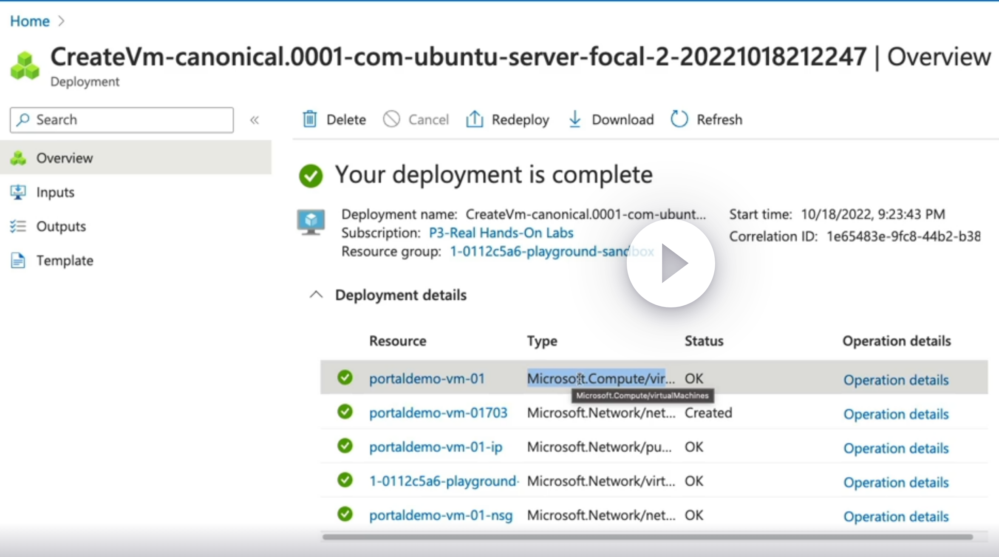

### summary
* login via Entra ID identity
* CRUD azure resoruces 
* manage azure via cloud shell
* manage billing
* log support tickets

## using Azure CLI and Powershell

### describing Azure CLI and powershell

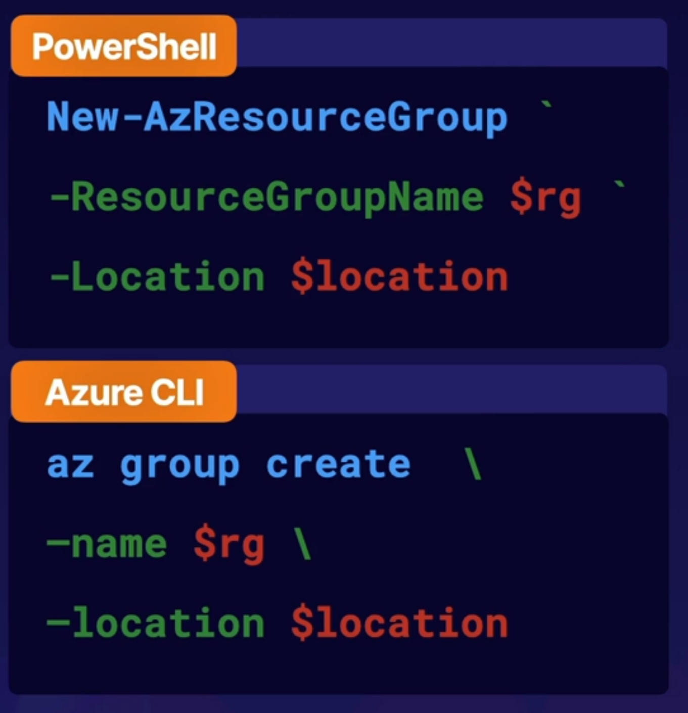

#### azure CLI
* command line utility for managing azure resources
* perform CRUD operations without logging in to Azure portal
* create scripts to automate tasks

#### Powershell
* set of cmdlets for managing azure resources
* perform CRUD operations without logging in to Azure portal
* create scripts to automate tasks

### demo using cli and powershell
* login to azure portal
* use cloud shell

  
  * you will need to create storage account, etc
  * start a powershell instance
* get resourcegroup
  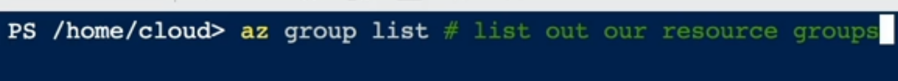
    * returns various defaults attribs about resourcegroup list in json
  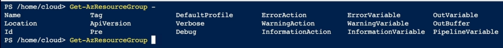
* create azure resources
  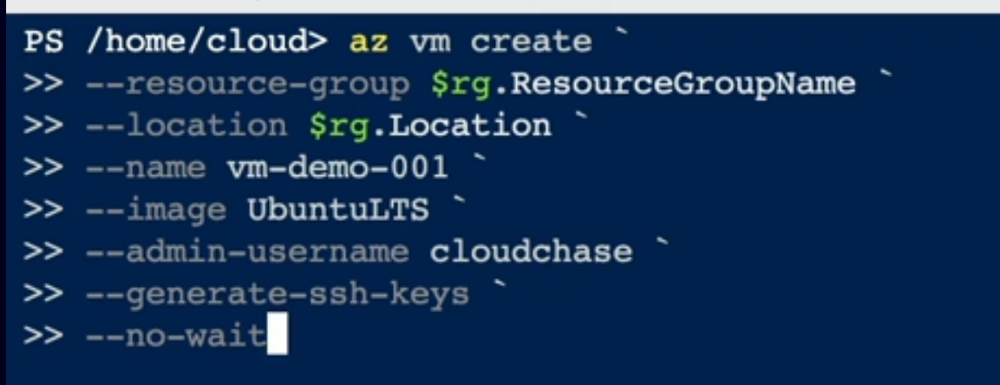
  * `--generate-ssh-keys` stores keys locally (either in azure cloudshell or on your local machine)
    
* verify VM creation
  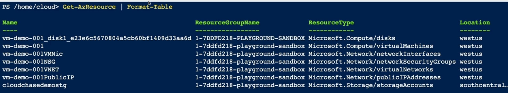
* you can use vscode in the cloudshell by invoking `code`

### summary
* azcli and powershell can:
  * manage azure resources locally (including in azure cloudshell)
  * create scripts for automation
  * no need to log in to the Azure portal

## Using ARM templates

### what are ARM templates
* ARM templates are "azure resource templates"
* IaC
* Deploy environments quickly
* repeatable deployments
* scope of application of an ARM template: can be a resource group, can be a subscription
  
### components of ARM templates

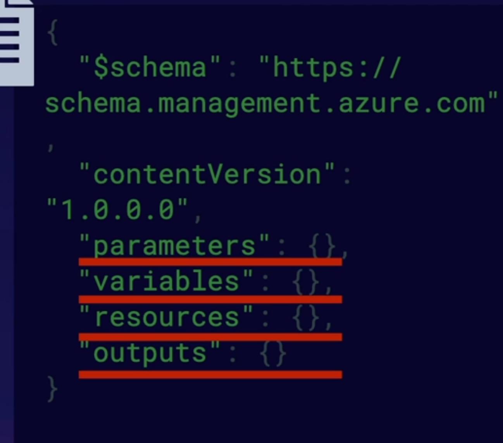

* is JSON
* `parameters` (passed at run time) and `variables` (hard coded) components are used to pass info via template.
* `resources` component is used to define resources in the template
* `outputs` component is used to return output from the execution of the template.

### demo using ARMs templates
* get template from github
* deploy to azure cloud
  * go to "Deploy Custom Deploy" in ARM
  * Resource Visualizer
    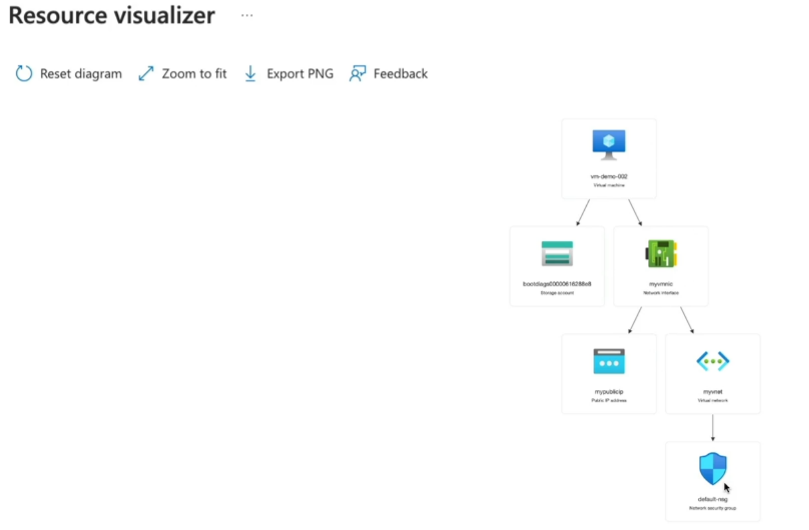
  * in the custom template, you can make some adjustments
    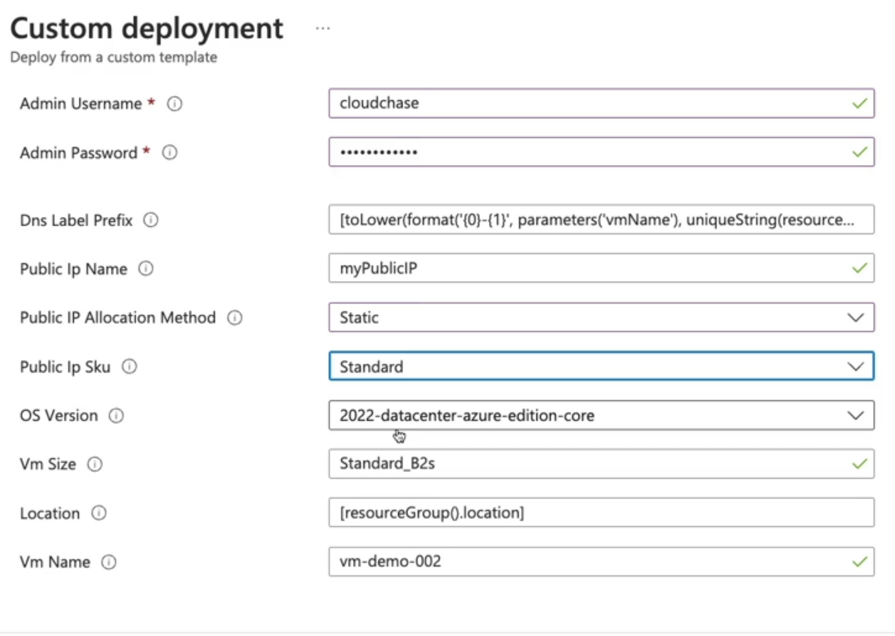
  * create
    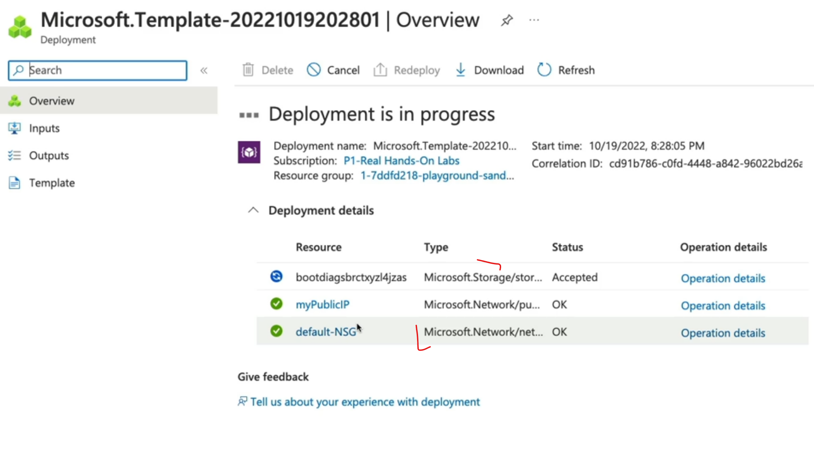
* verify the creation of resources
  * can active review resource group in ARM to verify creation
* note that you can address items via variables:
  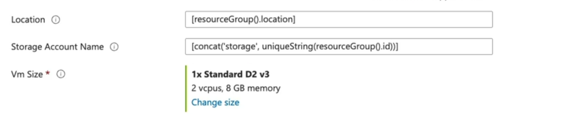

### summary
* ARM templates are Declarative JSON (IaC)
* quickly deploy repeatable and modular envs
  * you can call other ARM templates from ARM templates

# governance and compliance

## Managing Subscriptions

### describing subscriptions
* billing unit that aggregates all costs of underlyind `resources`
* contain `resource groups` and their associated `resources`
* scoping level for governance and security
  * AD tenant
    * roles can be applied to subscriptions, etc.

### types of subscriptions
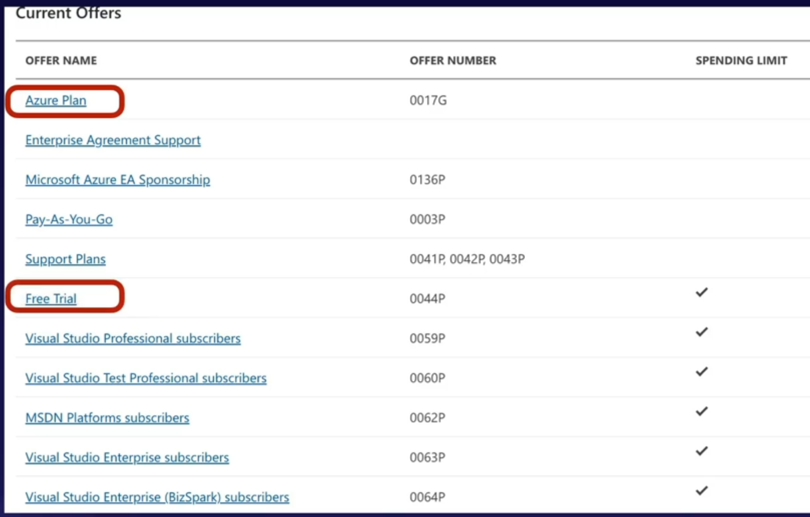

* login to ARM
* type subscriptions
* go to add another subscriotion
* review offers

### subscription naming convention suggestions
* prod/dev/staging
  * subscriptions are named based on whether they are prod, dev, or staging envs.
* departments/teams
  * subscriptions are named based ont he dept or team the sub is split up so that billing can then be easily associated with a given business unit.
* region
  * subs are named based on the region of the business that uses the subscription.

### summary
* subscriptions:
  * billing unit that aggregates all costs of underlying resources
  * contain resource groups and associated resources
* scoping level for governance and security
* can be associated with a single organization Entra ID tenant at a time

## using management groups

### defining mgmt groups
* logical container to organize and manage subscriptions and other mgmt groups
  * organization hiearchy
  * provides another scope for enforcing governance and compliance

### understanding hierarchy

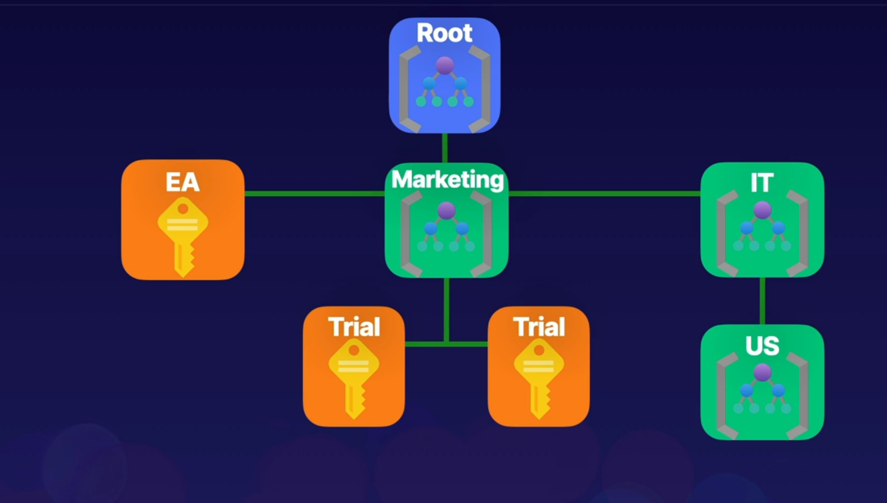

* parent-child relatonships
  * root mgmt group is the top-level 
  * mgmt groups and subs can have a single parent
  * supports six levels of hierarchy
* compliance support (to target mgmt groups and subscriptions, via hierarchy):
  * Azure Policies
  * Azure RBAC

### scoping influence
* RBAC (as users icon), scope (as target icon), subscription (as key icon)

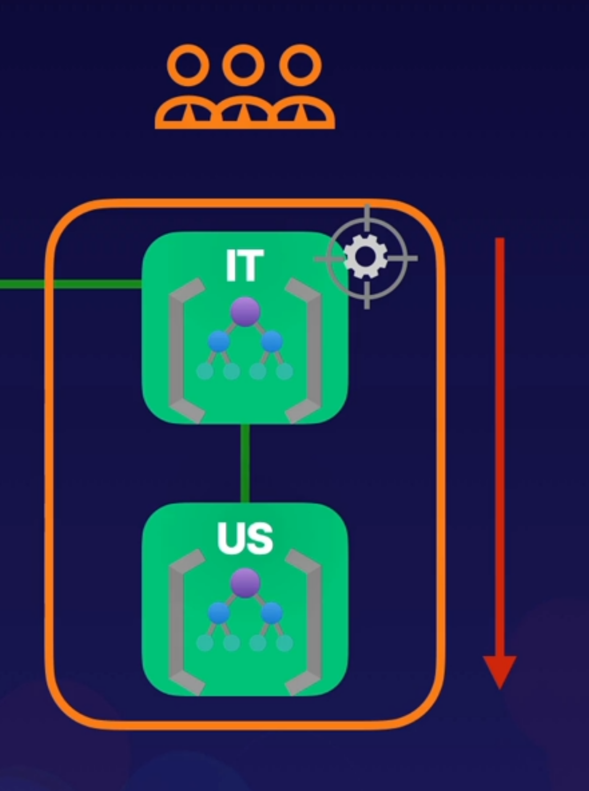

### demo:
* go to management groups/overview
* can create resources, etc.
* can add role assignments (ie: billing reader, etc)

### summary
* mgmt groups provide hierarchy of management
* root management group access is not given by default
* root management group can't be moved or seletec
* Azure RBAC is supported for mgmt groups
* Global Administrators must be elevated to USer Access Administrator of root group.
  * temporarily assign this role only

## Understanding Azure Policy

### define azure policy
* enforce compliance and enable auditing (detective controls, preventative controls, and corrective controls (this is a unique situation) )
* organizations need to implement enterprise-level governance and compliance capabilities
* uses
  * prohibit resources
    * control costs
    * restrict service access
  * restrict to allowed locations
    * geographical compliance

### components of an Azure Policy
* policy definitions: defines that evaluation criteria for compliance, and defines the actions that take place.  Either audit or deny should be something outside of compliance.
* policy assignment: the scope at which we will assign our policy.  The scope could be a mgmt group, subscription, resource group or resource.
* `initiative` definition: a collection of policies that are tailored to achrieve a singular high-level goal (ie: ensuring that VMs meet standards).

### policy example
* goal: "require tags"
* generate a policy definition
  * evaluate if a VM is being created with our tag "Project: az104" if the VM is missing the tag, then deny creation of resource.
* policy assignment
  * assign the policy at the scope of the resource group where the VMs will be created.

### demo: policy
* go to ARM/Policy
* authoring/Definitions (there are many built in)
  * each definition has some parameters:
    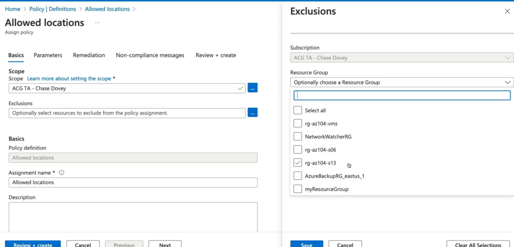
  * Policy Enforcement: when enforcement mode is disabled, the policy effect isn't enforce (ie: deny policy won't deny resources).  Compliance assessment results are still avialable (see https://aka.ms/enforcementMode )
* Assignments
  * takes about 30 minutes to apply and scan
  * You can then go to policy/compliance to review
    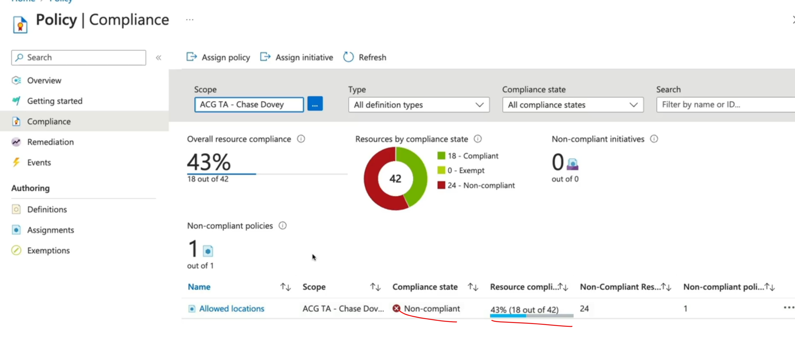
* Exemptions
  * they occur during assignments

### summary
* Azure Policy applies governance
  * create manage and assign policies.
  * Can be used to enforce (you can deny creation of resources outside of compliance) or audit compliance on resources.
* Policy components:
  * policy definition
  * policy assignment
* Many policies can be combined:
  * Initiative definition: can scope many definitions

## tagging resources

### describing resource tagging
* what are tags? name:value pair that can be attached to objects in Azure Tenant.
* name can be 512 chars, value can be 256 chars (storage accounts name can only be 128 chars)
  * can't reuse the same name in the same scope
* examples:
  * Dept:Marketing
  * Env:Prod
* usage:
  * cost analysis
  * Azure Policy

### resource tag assignment hierarchy
* `tags` are NOT inherited from assignment scope/by hierarchy
  * Azure Policies can enforce inheritance
* a resource can have a maximum of 50 tags

### demo: tagging resources

* determine tag
* tag a resource group
* log in to Azure portal
  * ARM/Resource Groups
  * Access resource gorup, tags on left pane
    * ms-resource-usage: production
    * this tag will NOT fall down to resources in the resource group

### summary
* tags (name/value pairs) can be used to:
  * manage resources
    * shutting down all VMs via a tag, or enforce policy, or billing
* tags are not inherited, but can be via Azure Policy

## LAB: Add, Remove and Update Tags for Resources in Azure

* Add Tags to the Resource Group
  * add tags via cloud shell:
    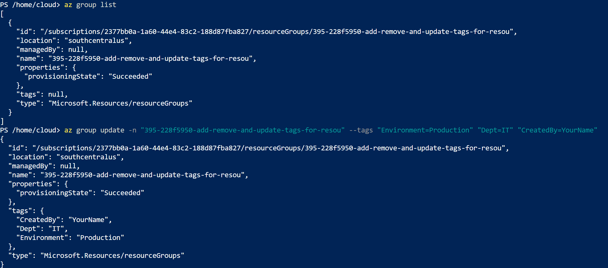
  * verify:
    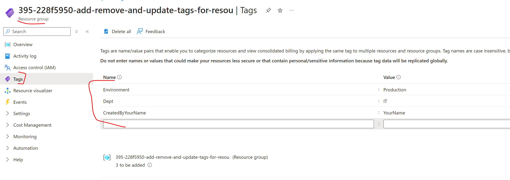
* list VMs and filter using JMESpath
  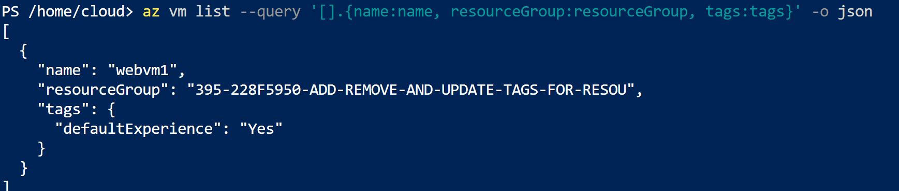
* Remove Tags for VM
  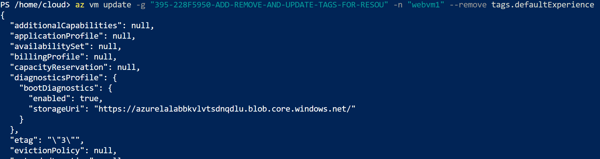
* Add tag "MarkForDeletion"
  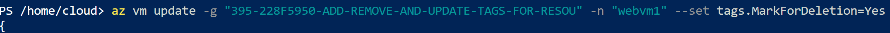
* Change Tags for the Virtual Network
  * list:
    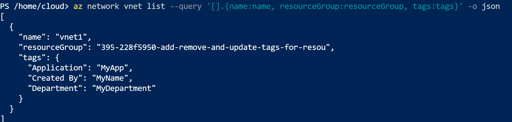
  * set:
    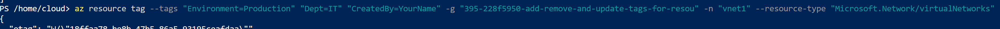

## Logging and moving resources

### describing Resource Locks
* what are locks:
  * locks allow you to overrise perms to resources
  * can lock subscriptions, resource grops or resources
  * locks apply to all users and roles

### Types of Resource Locks
* `ReadOnly`: allows authed users to resource, but can not delete or update resource (ie: you can't power off a VM... you can't affect state at all!)
* `CanNotDelete`: allows authed users to read and modify a resource, but can't delete. (ie: you can't delete a VM)
* will inherited from the parent scope! (opposite of tags)

### Moving Resources
* taking a resource contained in a place (like a resource groups), can move to other resource groups within subscription, or to RG in another subscription.
* moving is write and delete operation
* some resources don't support moving

### Demo: locking and moving resources
* login to ARM web UI
* Create VM resource
  * check out [azure-quickstart-templates](https://github.com/Azure/azure-quickstart-templates)
    * ie: https://github.com/Azure/azure-quickstart-templates/blob/master/quickstarts/microsoft.compute/1-vm-loadbalancer-2-nics/azuredeploy.json
* Add a delete lock
  * review locks: in RH, left side pane> settings> locks> add a lock
  * note that the scope
    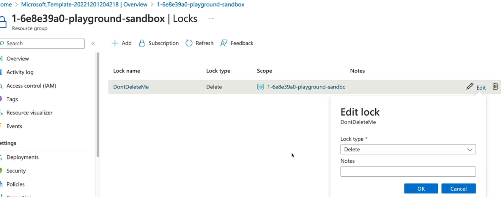
* move resources
  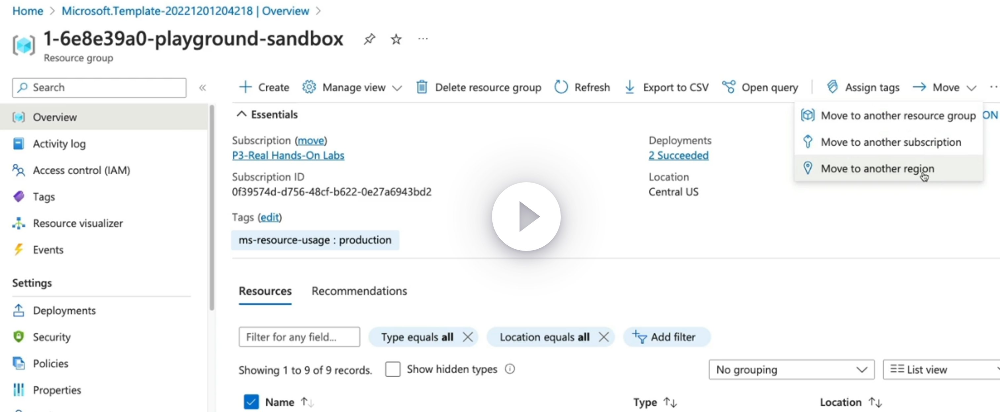

### summary
* resource lock types:
  * `ReadOnly`: allows authed users to resource, but can not delete or update resource (ie: you can't power off a VM... you can't affect state at all!)
  * `CanNotDelete`: allows authed users to read and modify a resource, but can't delete. (ie: you can't delete a VM)
* there is inheritance for locks

## managing azure costs

### what impacts cost?
* subscription type: free, pay-as-you-go, enterprise agreements, cloud solution provider
* resource type: various types have different costs (storage account blob storage vs. table storage)
* usage meters: CPU time, ingress/egress network traffic, disk size...
* resource usage: the costs of actually using a resource (ie: VM run time)
* region/location: the costs for various services vary across geographic regions

### cost best practices and tools
* Best practices
  * select the appropriate resoruce for the use case (ie: PaaS, SaaS, IaaS)
  * understand resource needs (right sizing)
  * deallocate resources when not needed
  * use cloud capabilities where possible (ie: scalability, elasticity)
  * Plan costs prior to purchase
* cost tools:
  * pricing calc: how much will resources cost us to run at given spec
  * TCO calc: analyze on-prem workloads and obtain costs
  * Microsoft Cost Management:
    * analyze costs
    * create budget

### demo: using Microsoft Cost Management
* must have Billing Manager role to scope
* main dashboard:
  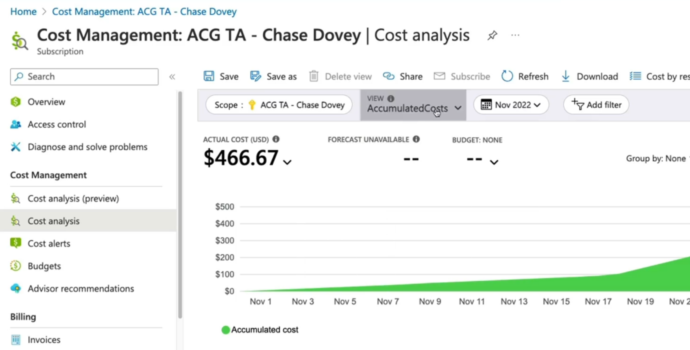

### demo: using pricing calculator
* is public facing
* estimate workload costs
* modify workload details
  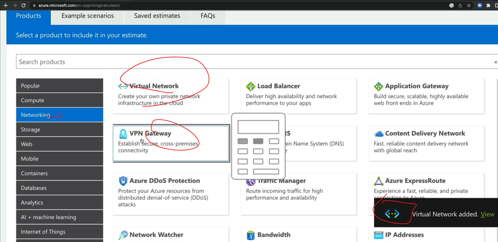

### demo: using TCO calc
* how much will on prem services costs to run in Azure cloud

### summary
* pricing calc: how much will resources cost us to run at given spec
* TCO calc: analyze on-prem workloads and obtain costs
* Microsoft Cost Management: analyze costs, create budget

## building a cloud governance strategy with azure tool

### Define governance
* define rules, policies, compliance standards
* define control over resources, enforce rules, policies and standards

### planning a cloud staregy
* define: define the cloud governance needs of the organization 
  * driven by things like regulatory
* Plan: plan which tools will be used to implement governance
* Ready: understand how those tools will be used to implement governance
* adopt: implement governance for the org using a cloud strategy

### governance services
* management groups and subscriptions: organize subscriptions into heirachical structures
* Azure RBAC (roles): provide access to resoruces at varying scopes.
* Azure Policies: implement policies to enforce standards
* Locks and tagging: lock resources to preevent deletion, and tag resources to categorize.

### summary

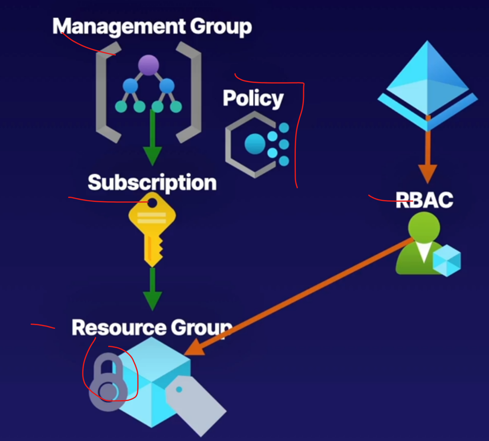

* management groups/subscription/resource group hierarchy
* policies are used to control
* (RBAC) role assignment to resource groups
* locks

### expand knowledge
* Azure blueprints: allows for an entire Azure build (including subscriptions, etc) as per a description focused around environment object and policy creation (including ARM templates) and will help with governance.

# Identity

## Identity in Azure
* Azure AD / Entra ID
  * IAM basics
  * define Entra ID
  * Entra ID tenant
  * Entra ID architecture
  * compare Entra ID with legacy AG
  * Create and switch between tenants
* Entra ID Users
  * define users, types of users, methods of creating users, architecture
  * create and delete users
  * perform bulk user updates
  * invite guest accounts
* Entra ID groups
  * define groups, group and membership types, RBAC
  * create dynamic groups
  * assign access to resources
* Entra ID join:
  * define Entra ID Join, device settings and conditional access
  * join Windows 10 to Entra ID
* Administrative units:
  * Define MFA and self-service password reset (SSPR)
  * enable MFA
  * enable SSPR

## conceptualizing Entra ID

### IAM basics
* principal: unauthed entity that will seek to auth as an identity
* identity: identity profile that is authed against using creds
* authorizations: actions that are permitted/prohibited for an identity to perform

### what is Entra ID
* is an... IAM management solution: a global cloud-based identity service for Azure that provides an identity resposiroty
* allows for... creation identity resources: create users and groups 
* is a... management plane for identity-based security: enable MFA, control resource access, and provide policy-based controls
* organization == tenant == directory

### Entra ID Tenant Architecture
* Entra ID is a global service across the Azure cloud
* our specific tenant instance is local to a geography (ie: United States, EU)

#### creation of Entra ID tenant:
* a domain is created when requested
* the tenant provides RBAC to perform actions on subscriptions

### Entra ID Features
* IAM platform: Entra ID is the RBAC solution that grants access (via RBAC) to Azure tenant and it's resources and management functions.
* Identity security: additional security with MFA (conditional access policies) and Privileged identity management (PIM)
* Collaboration and Developent: Entra ID B2B and B2C (covering later)
* Monitoring: audit logs, security monitoring, identity protection and risk management (derive risk levels of identities)
* identity integration features: hybrid identity and SSO using Entra ID Connect and Azure AD Domain Services.
* Enterprise access: additional security for apps and devices on prem and in the cloud

### Entra ID versus Legacy AD
* AD:
  * OUs
  * GPOs
  * Kerberos, LDAP,NTLM
  * Hiearchical
  * on-prem
* Entra ID:
  * Administrative units
  * SAML, WS-federation, OAuth
  * flat directory structure
  * cloud-based solution
  * Global
* bridge the two together using Entra ID Connect

### summary
* Entra ID
  * Tenant is the organization instance
* purposes:
  * IAM: global cloud-baed identity service for Azure that provides an identity repo.
  * Create identity resources: create users and groups.
  * Manage identity security: enable conditional access policies, control resource access and provide policy-based controls across all Azure resource instances and management functions.

## managing tenants

### planning our organization / designing tenants
* planning out the design of oure tenant will supprot easy adoption
  * Build security Foundations: set up best practices (ie: SSPR, MFA, backup global admin and prived users) for specific tasks
  * populate identity resources: add users, create groups, add devices, and set up hybrid identity.
  * manage apps: identity apps to be used from the app gallery and register apps from on-prem.
  * Monitor and automate: monitor admins, perform access reviews and automate user lifecycles.

### demo: creating a tenant
#### create a tenant
* login to ARM and access Entra ID
  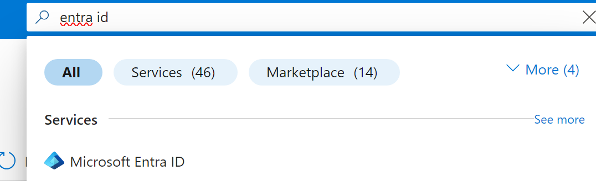
* review config of tenant:
  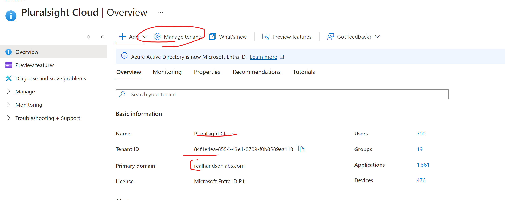
* Create
  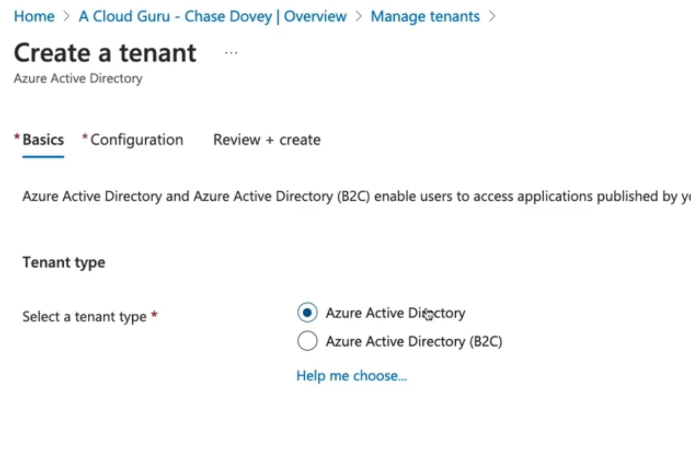
  * B2C provides external users access to applications (as application/resource authentication can integate directly into B2C directories)
  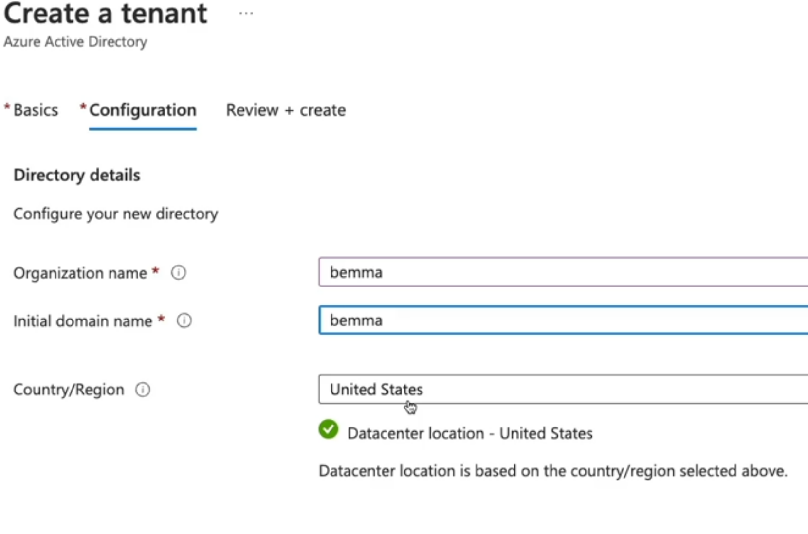

### summary
* Entra ID tenant is within your region
* inside the tenant all identity resources exist

## creating and managing users

### describing users
* Entra ID contain users and group objects (ie: administrators, members, guests)
* each identity object has:
  
  * permissions
  * can be JSON objects
  * each user can have role assignments
  * each user can have object ownership (ie: a user can own a group)

### types of users
* administrators: users with adminsitrator role assigned
* members: regular users that are native to Entra ID
* guests: external users that are invited to the Entra ID tenant

### demo: creating a user

* methods of creating users
  * Azure portal: Entra ID service> users> new user
    
  * Azure CLI: `az ad user create`
  * Powershell: `new-azureaduser`
* create a user inside of Entra ID tenant
  * can set a usage location
  * can block user signin

### demo: managing user properties
* update user profiles to show that the user is part of HR department
  * find user in Entra ID
  * edit properties

### demo: bulk adding users
* using a CSV to bulk add users
  * go to Entra ID
  * bulk operations, then download a CSV
  * the CSV has examples, and make sure you include trailing commas
  * upload files

### demo: inviting guests
* go to entra ID
* click New User> invite new user
* select template> invite user
* requires only email.
* Entra ID will send an email
* user type will be Guest

### summary
* Entra ID tenant users and groups exist
* types of users: admins, member, guests
* Role assignment: determines perms and access
* Object ownership: apps, devices, groups and resources that are owned

## LAB: Create and Manage Microsoft Entra ID Users in the Portal

### Create Microsoft Entra ID User Accounts
* 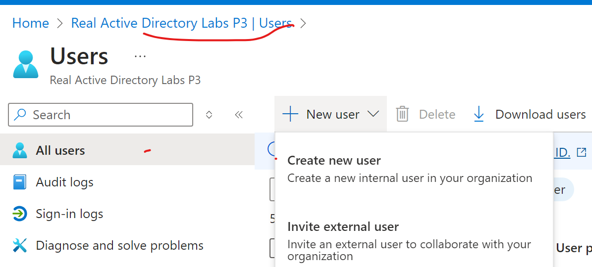
* 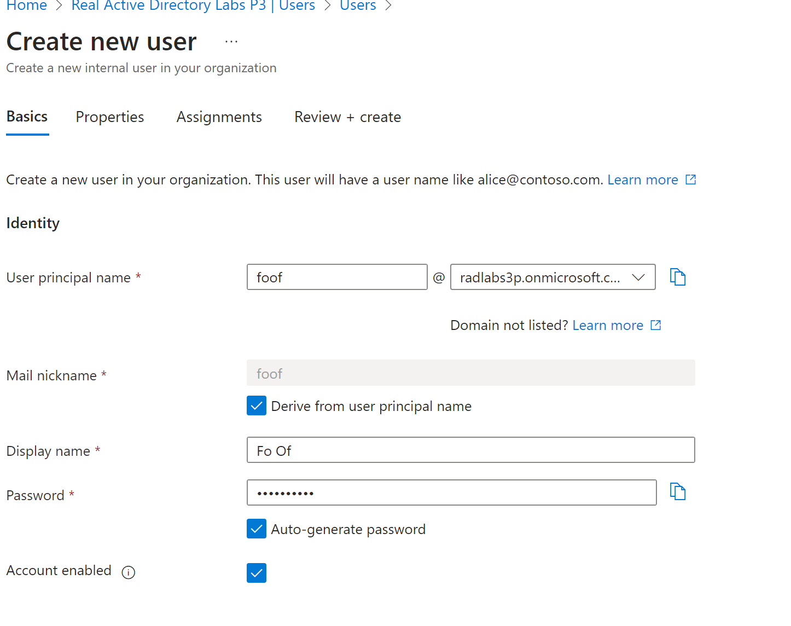
* 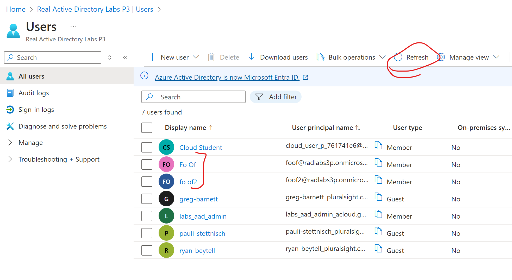

### Modify a Microsoft Entra ID User Account
* 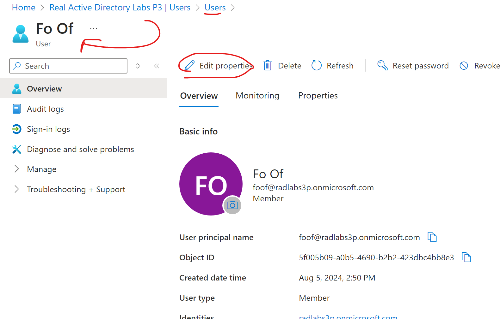
* 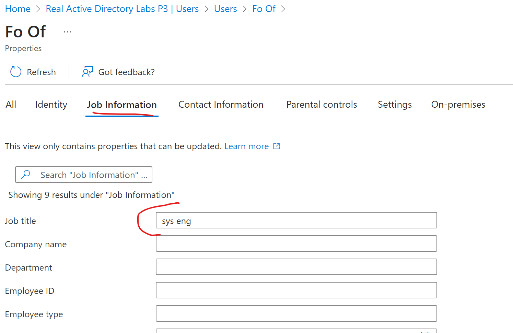
* reset password
  * 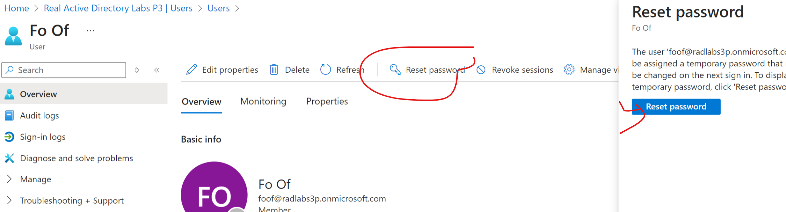

### Revoke Access to a Microsoft Entra ID User Account
* 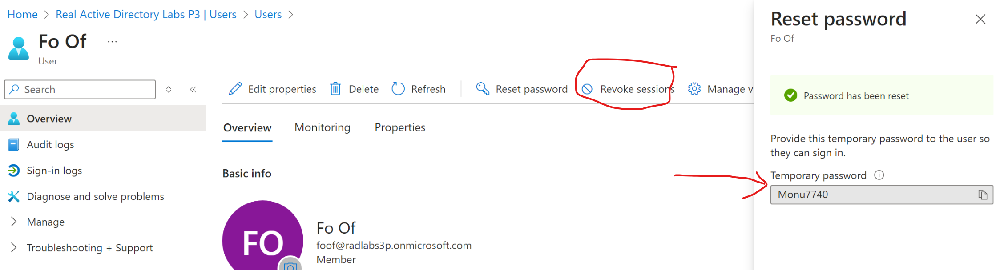

### Delete a Microsoft Entra ID User Account
* 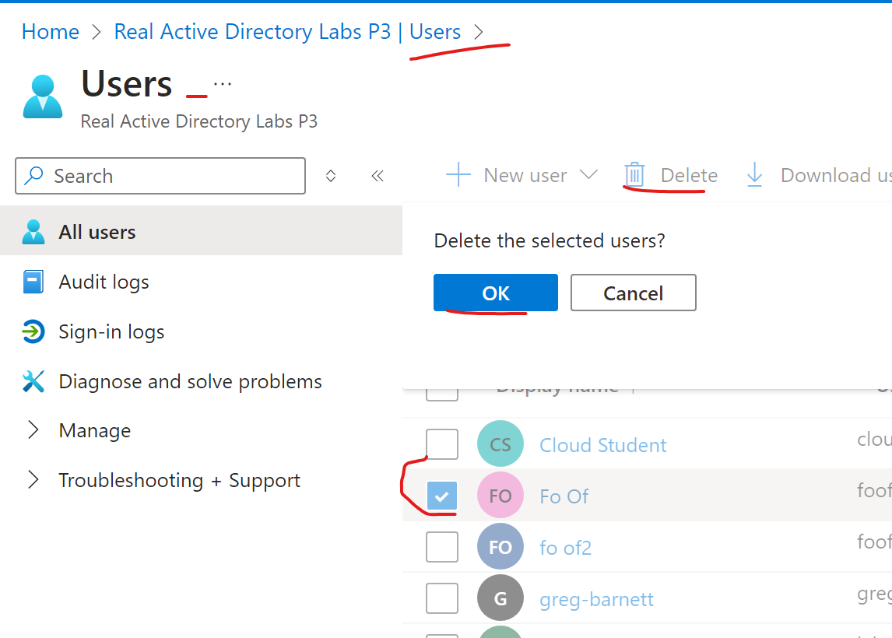
* 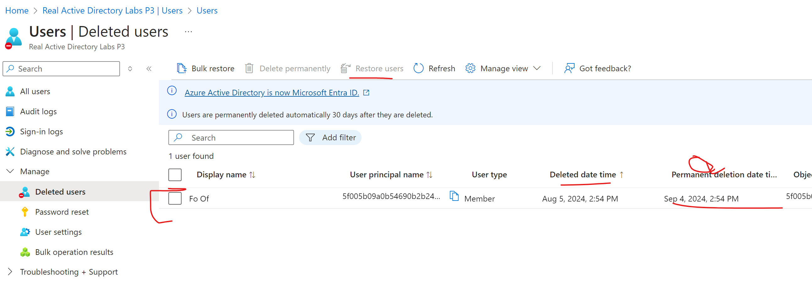
* deleted users remain to be able to be restored for 30 days

## LAB:

### bulk create users
* 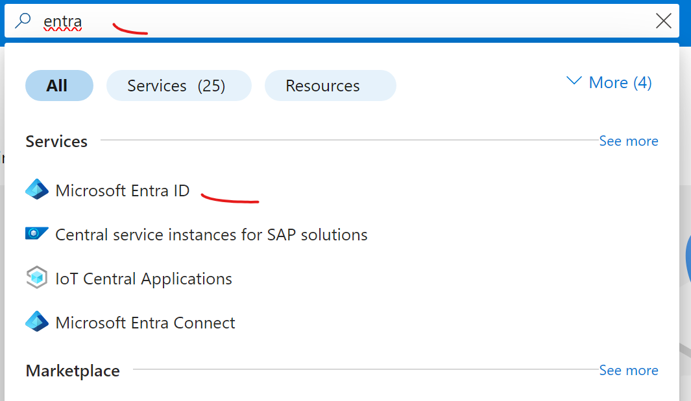
* 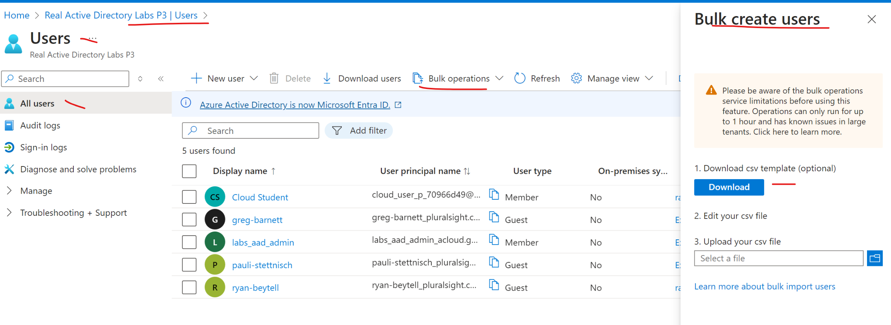
* OBtain domain name by reviewing the Entra ID tenant info page and update the users
* 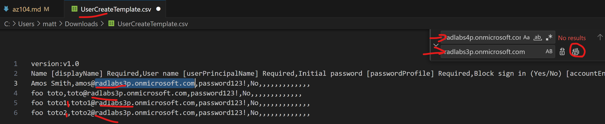
* 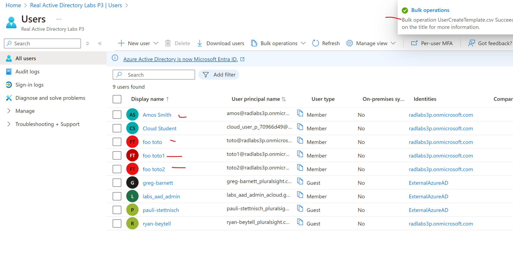

### bulk delete users
* 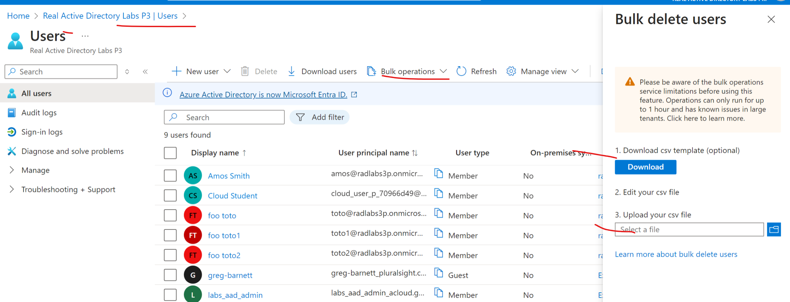
* 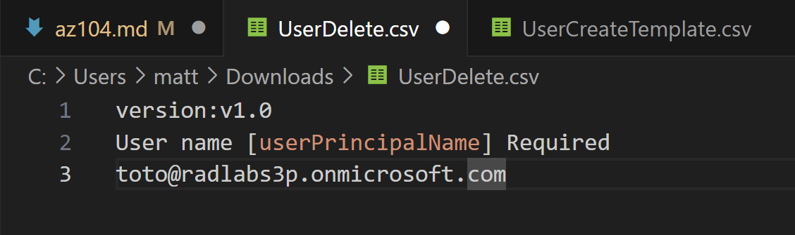
* blah blah

### bulk add group member
* create a new group of security group type
* 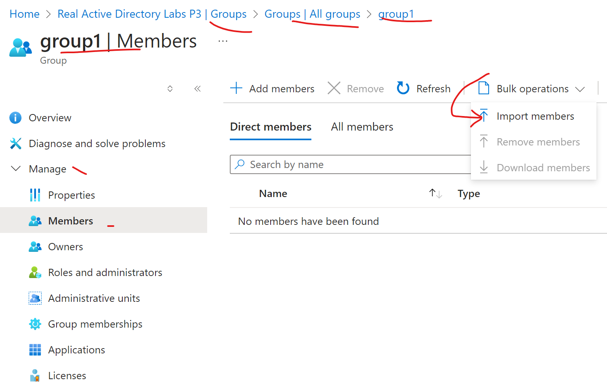

## creating and managing groups

### describing groups
* Entra ID tenant has user and groups objects
* leverage groups to provide groups of users to apply roles
* owner and members: an owner of the group or a member of the group
* type of group: a security group or a M365 group
* membership type: assigned, dynamic user, or dynamic device

### practical use of groups
* RBAC:
  * rule based/dynamic assignment:  department value == "HR", then in "HR Group"
  * dynamic group assignment requires above E1 licensing

### demo: creating a group
* access ARM
* create a group

### demo: managing group membership
* go to groups
* 
  * Dynamic User (group of users)
* 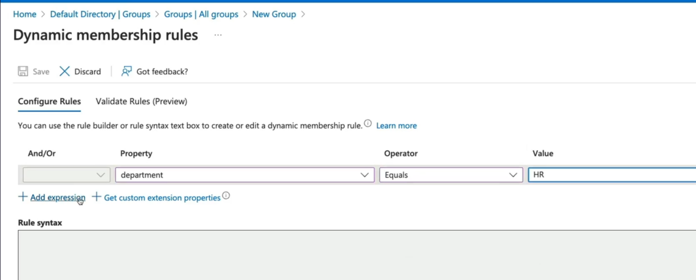
* validate the rule
  * set scope of all users

### summary
* group types:
  * security groups: are used to manage access to shared resources for a group of users
  * M365 gorups: used to give members access to shared mailbox, calendar, files, etc
* Membership types:
  * assigned: static group membership
  * dynamic user: logic based given user properties
  * dynamic device: created that automate group membership via device attributes.

## LAB: Create a Group and Add a Member in Microsoft Entra ID
* https://learn.acloud.guru/course/160303d7-6947-4fbc-9d19-fa304849f92e/learn/175d605b-0154-4bb4-b924-8f8358787113/acdc78a6-56a6-4c1c-ad3d-717a5dc2bfa0/lab/acdc78a6-56a6-4c1c-ad3d-717a5dc2bfa0

### Create a New Microsoft Entra ID Group
* yarp.
  
### Add a Microsoft Entra ID User as a Member of the Group
* yarp.

### Create a New Microsoft Entra ID User
* yarp

### Add a Microsoft Entra ID User as an Owner of the Group
* yarp

## Creating administrative units

### describing administrative units
* create logical containers inside of Entra ID that contain resources (such as groups) that can have RBAC roles attached to them.
  * For example, you might have a group called HRGroup with users in the US and users in the EU.  You want to restrict the HRGroup that's in the US to only be admined by helpdeskadmins in the US, and vice-versa.  You can create an administrative unit for the HRGroup in the US based on specific field values.  This avoids assigning roles to Tenants.

### business use case for adminsitrative units
* similar to the above example

### demo: creating administrative units
* plan the organization: evaulate its needs to determine the value that administrative units can provide for managing identities, like groups and users.
* create an Administrative Unit: to logically divide the organization and allow for scoping.

* access Entra ID
* access administrative units, membership type is "assigned" (other types is `dynamic user` and `dynamic device`).
* you can assign a role, and then select a user.

### summary
* purpose of administrative units: an Entra ID resource for providing a container for Entra ID objects.
* allow you to control the scope of your administrative users.
* Use case: administrative units based on geographical locations, business departments, or subsidiary organizations of a parent organization.

## configure self-service password reset (SSPR)

### describing SSPR
* old school password reset method
  * single point of failure: helpdesk admin resets user's passwords
    * creates admin overhead and creates less productive users.
* enables users to change or reset, increases their productivity, and decreases admin overhead

### SSPR Process
* check browser localization settings
* verification of identity
* authenciation
* password reset
* notification for user and administrators

### auth methods when using SSPR
* mobile app: authentication via app notification.  An example is the MSFT authenticator app.
* mobile app code: autentication via TOTP.
* Email: codes sent via email.
* Mobile phone: SMS or phone call
* Office phone: calls and prompts user to press #.
* security questions: auth via answerring a set of security questions (not recommended) 

### SSPR considerations
* enable and manage SSPR via Entra ID groups
* required methods: one or more available auth methods is required
* SSPR for admins: security questions not available for admins.  By default, admins must register for MFA methods.
* Required licenses: Entra ID P1 or P2, Microsoft apps for business or M365 licensing is required for SSPR

### demo: setting up SSPR
* enable SSPR
  * go to Entra ID
  * password reset
  * manage/properies
    * "selected" you can select a group
    * "all" is all users
  * authentication methods:
    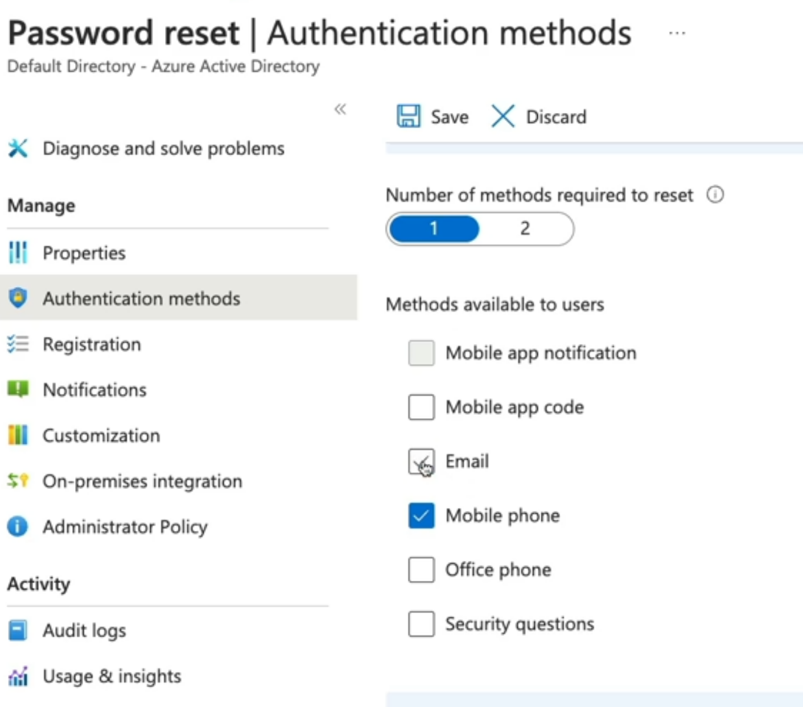
    * 1 or 2 methods
    * select methods available
  * Registration: require users to register when signing in?
  * notifications:
    * notify users when their passwords are reset
    * notify all admins when other admins reset their passwords
  * on-premises integration
* test SSPR
  * can create a new user
  * and then login, setting up

### summary
* SSPR:
  * unauthed users use SSPR
  * decreases admin overhead
  * securre password reset for users and admins

## Entra ID Device management

### basics of device identity
* BYOD can be registered
  * to control access to resources, data, assets

### registration options
* Entra ID registered
  * least restrictive option, allowing BYOD with a personal MSFT or local account.
  * Supports Windows 10/11, iOS, iPadOS, Android, and macOS
* Entra ID joined
  * device is owned by the org and accesses Entra ID through a work account.  These identities exist only in the cloud.
  * supports Windows 11/11, SErver 2019
* Hybrid Entra ID Joined
  * Similar to Entra ID Joined
  * however, these device identities exist both on-prem and in the cloud.
  * supports: Windows 7, 8.1, 10, 11, Server 2008 or later

### demo: managing devices
* login to ARM
* access entra ID
  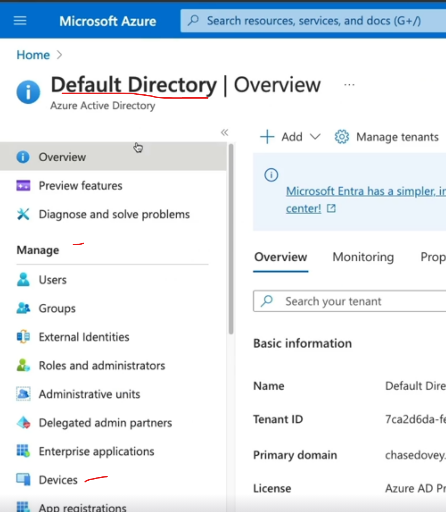
* go to All Deviecs and review
* go to Device SEttings (who and how)
  * options for user scope
    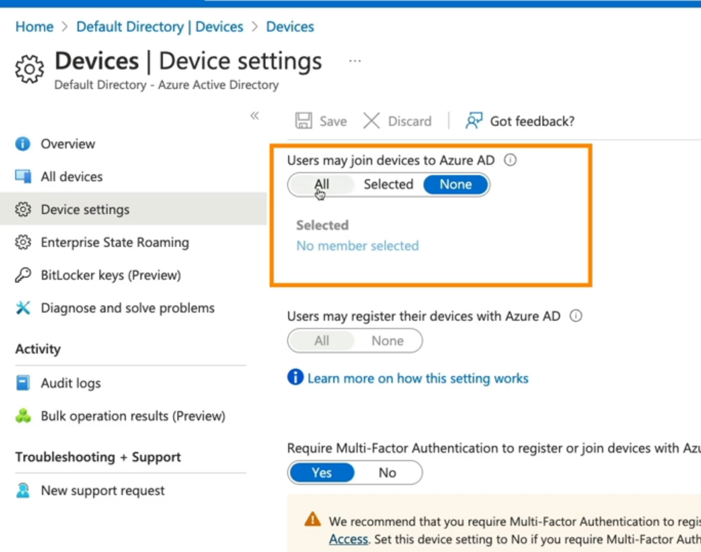
    * "users may registr their devices with Entra ID" == Entra ID registered (BYOD)
  * Administative users can be added to "Entra ID joined" devices only as local users

* join device as Entra ID registered
  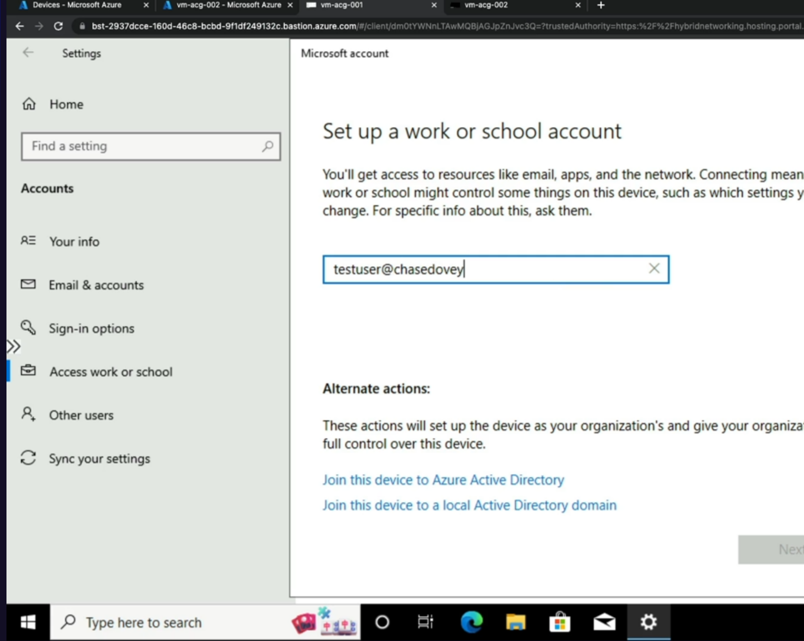
  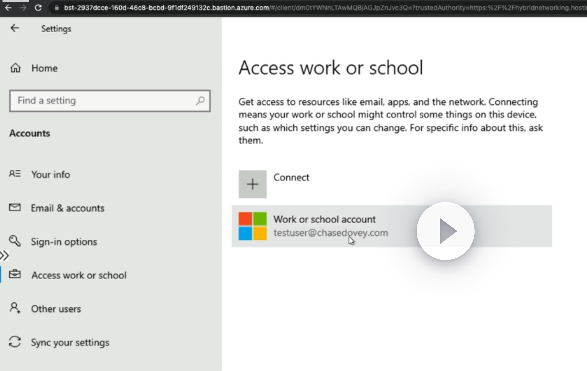

* Note that you must be a local admin on the machine to join the machine to Entra ID (similarly to legacy AD):
  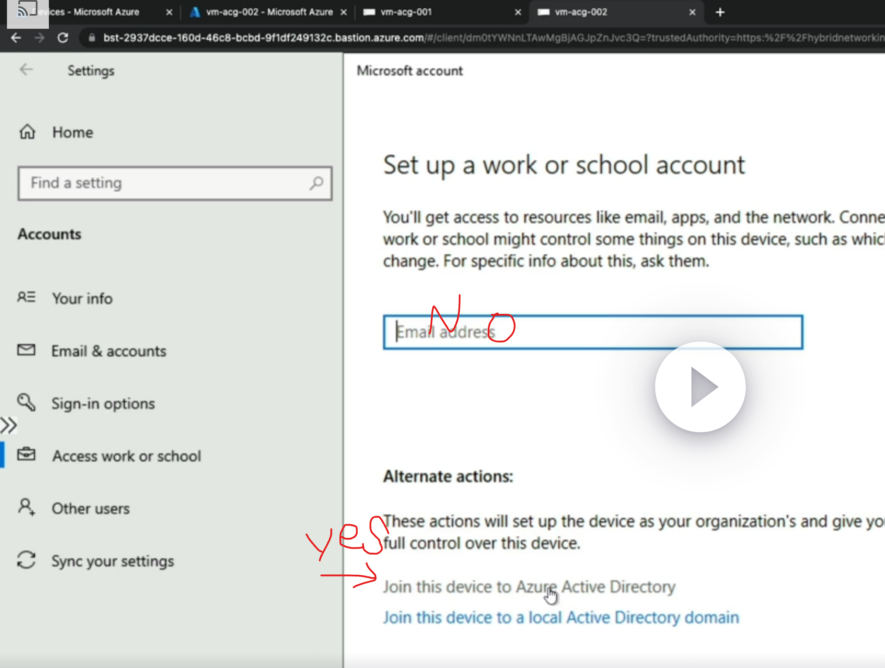
  

### summary
* device identity: gives devices identities so that the devices can access resources in Entra ID
  * simplified procedure for adding and managing devices
  * improve user experienc on devices
  * SSO for any registrered or joined

## identity summary
* Azure AD / Entra ID
  * IAM basics
  * define Entra ID
  * Entra ID tenant
  * Entra ID architecture
  * compare Entra ID with legacy AG
  * Create and switch between tenants
* Entra ID Users
  * define users, types of users, methods of creating users, architecture
  * create and delete users
  * perform bulk user updates
  * invite guest accounts
* Entra ID groups
  * define groups, group and membership types, RBAC
  * create dynamic groups
  * assign access to resources
* Administrative units:
  * Define MFA and self-service password reset (SSPR)
  * enable MFA
  * enable SSPR
* Entra ID join:
  * define Entra ID Join, device settings and conditional access
  * join Windows 10 to Entra ID

# Role-based access control (RBAC)

## understanding roles in Azure
* https://learn.acloud.guru/course/160303d7-6947-4fbc-9d19-fa304849f92e/learn/489ddeb2-2f84-4ea2-8acd-c3261cb89ff2/b993fb4c-044f-40e6-abef-7b7a2fa4236b/watch