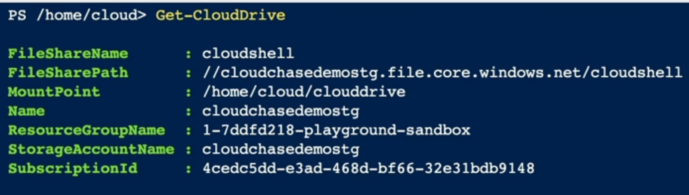
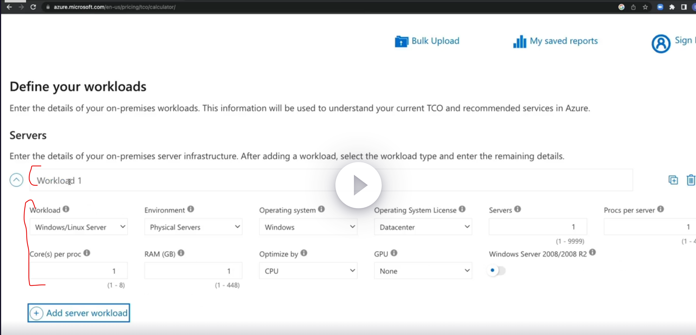
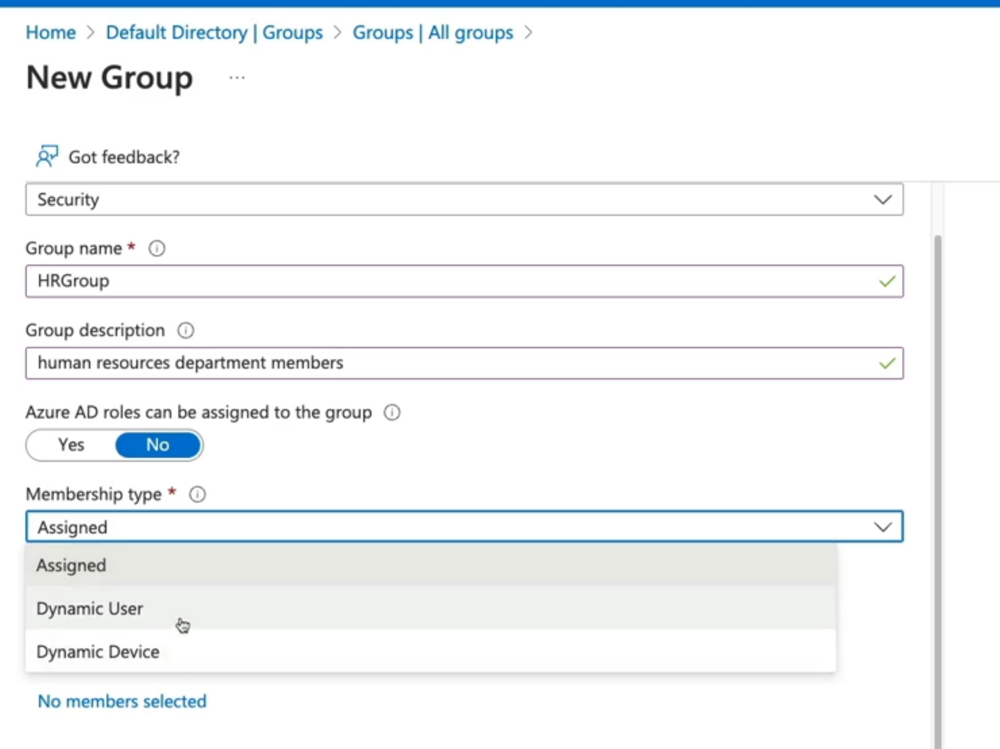
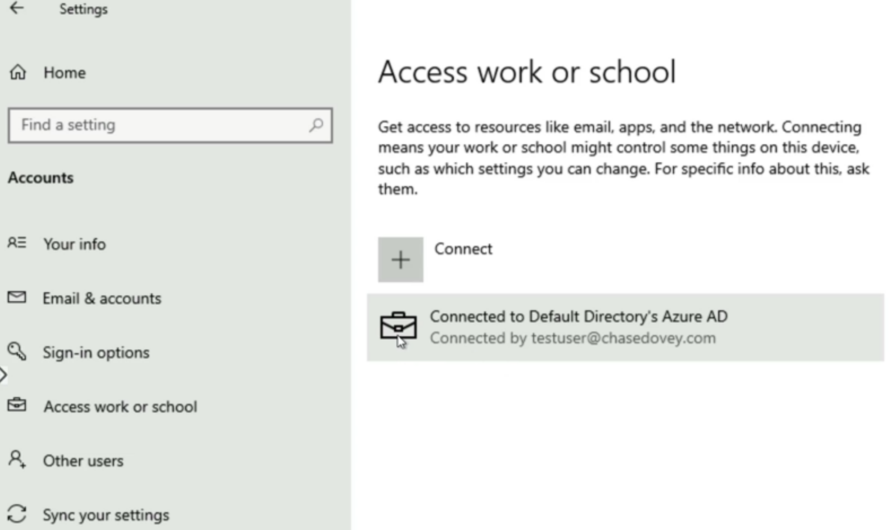
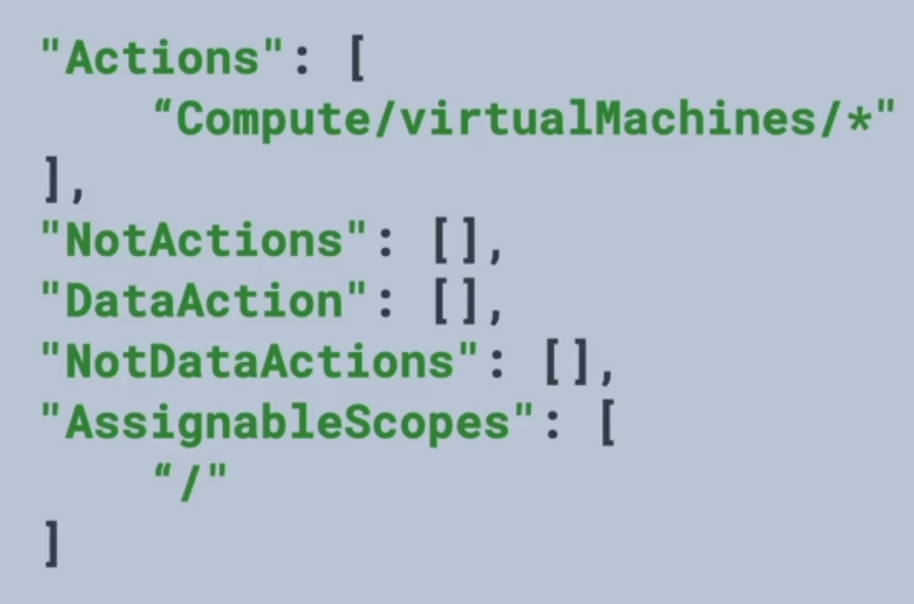
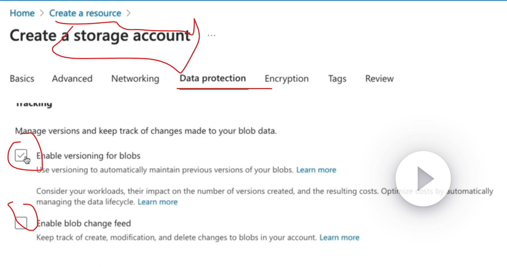

- [AZ-104 Microsoft Azure Administrator Certification Prep](#az-104-microsoft-azure-administrator-certification-prep)
- [Azure Administration](#azure-administration)
  - [Understanding Azure Resource Manager](#understanding-azure-resource-manager)
    - [azure cloud fundamentals](#azure-cloud-fundamentals)
    - [exam tips](#exam-tips)
  - [using azure portal and cloud shell](#using-azure-portal-and-cloud-shell)
    - [describing azure portal](#describing-azure-portal)
    - [components of azure portal](#components-of-azure-portal)
    - [demo of using azure portal](#demo-of-using-azure-portal)
    - [summary](#summary)
  - [using Azure CLI and Powershell](#using-azure-cli-and-powershell)
    - [describing Azure CLI and powershell](#describing-azure-cli-and-powershell)
      - [azure CLI](#azure-cli)
      - [Powershell](#powershell)
    - [demo using cli and powershell](#demo-using-cli-and-powershell)
    - [summary](#summary-1)
  - [Using ARM templates](#using-arm-templates)
    - [what are ARM templates](#what-are-arm-templates)
    - [components of ARM templates](#components-of-arm-templates)
    - [demo using ARMs templates](#demo-using-arms-templates)
    - [summary](#summary-2)
- [governance and compliance](#governance-and-compliance)
  - [Managing Subscriptions](#managing-subscriptions)
    - [describing subscriptions](#describing-subscriptions)
    - [types of subscriptions](#types-of-subscriptions)
    - [subscription naming convention suggestions](#subscription-naming-convention-suggestions)
    - [summary](#summary-3)
  - [using management groups](#using-management-groups)
    - [defining mgmt groups](#defining-mgmt-groups)
    - [understanding hierarchy](#understanding-hierarchy)
    - [scoping influence](#scoping-influence)
    - [demo:](#demo)
    - [summary](#summary-4)
  - [Understanding Azure Policy](#understanding-azure-policy)
    - [define azure policy](#define-azure-policy)
    - [components of an Azure Policy](#components-of-an-azure-policy)
    - [policy example](#policy-example)
    - [demo: policy](#demo-policy)
    - [summary](#summary-5)
  - [tagging resources](#tagging-resources)
    - [describing resource tagging](#describing-resource-tagging)
    - [resource tag assignment hierarchy](#resource-tag-assignment-hierarchy)
    - [demo: tagging resources](#demo-tagging-resources)
    - [summary](#summary-6)
  - [LAB: Add, Remove and Update Tags for Resources in Azure](#lab-add-remove-and-update-tags-for-resources-in-azure)
  - [Logging and moving resources](#logging-and-moving-resources)
    - [describing Resource Locks](#describing-resource-locks)
    - [Types of Resource Locks](#types-of-resource-locks)
    - [Moving Resources](#moving-resources)
    - [Demo: locking and moving resources](#demo-locking-and-moving-resources)
    - [summary](#summary-7)
  - [managing azure costs](#managing-azure-costs)
    - [what impacts cost?](#what-impacts-cost)
    - [cost best practices and tools](#cost-best-practices-and-tools)
    - [demo: using Microsoft Cost Management](#demo-using-microsoft-cost-management)
    - [demo: using pricing calculator](#demo-using-pricing-calculator)
    - [demo: using TCO calc](#demo-using-tco-calc)
    - [summary](#summary-8)
  - [building a cloud governance strategy with azure tool](#building-a-cloud-governance-strategy-with-azure-tool)
    - [Define governance](#define-governance)
    - [planning a cloud staregy](#planning-a-cloud-staregy)
    - [governance services](#governance-services)
    - [summary](#summary-9)
    - [expand knowledge](#expand-knowledge)
- [Identity](#identity)
  - [Identity in Azure](#identity-in-azure)
  - [conceptualizing Entra ID](#conceptualizing-entra-id)
    - [IAM basics](#iam-basics)
    - [what is Entra ID](#what-is-entra-id)
    - [Entra ID Tenant Architecture](#entra-id-tenant-architecture)
      - [creation of Entra ID tenant:](#creation-of-entra-id-tenant)
    - [Entra ID Features](#entra-id-features)
    - [Entra ID versus Legacy AD](#entra-id-versus-legacy-ad)
    - [summary](#summary-10)
  - [managing tenants](#managing-tenants)
    - [planning our organization / designing tenants](#planning-our-organization--designing-tenants)
    - [demo: creating a tenant](#demo-creating-a-tenant)
      - [create a tenant](#create-a-tenant)
    - [summary](#summary-11)
  - [creating and managing users](#creating-and-managing-users)
    - [describing users](#describing-users)
    - [types of users](#types-of-users)
    - [demo: creating a user](#demo-creating-a-user)
    - [demo: managing user properties](#demo-managing-user-properties)
    - [demo: bulk adding users](#demo-bulk-adding-users)
    - [demo: inviting guests](#demo-inviting-guests)
    - [summary](#summary-12)
  - [LAB: Create and Manage Microsoft Entra ID Users in the Portal](#lab-create-and-manage-microsoft-entra-id-users-in-the-portal)
    - [Create Microsoft Entra ID User Accounts](#create-microsoft-entra-id-user-accounts)
    - [Modify a Microsoft Entra ID User Account](#modify-a-microsoft-entra-id-user-account)
    - [Revoke Access to a Microsoft Entra ID User Account](#revoke-access-to-a-microsoft-entra-id-user-account)
    - [Delete a Microsoft Entra ID User Account](#delete-a-microsoft-entra-id-user-account)
  - [LAB:](#lab)
    - [bulk create users](#bulk-create-users)
    - [bulk delete users](#bulk-delete-users)
    - [bulk add group member](#bulk-add-group-member)
  - [creating and managing groups](#creating-and-managing-groups)
    - [describing groups](#describing-groups)
    - [practical use of groups](#practical-use-of-groups)
    - [demo: creating a group](#demo-creating-a-group)
    - [demo: managing group membership](#demo-managing-group-membership)
    - [summary](#summary-13)
  - [LAB: Create a Group and Add a Member in Microsoft Entra ID](#lab-create-a-group-and-add-a-member-in-microsoft-entra-id)
    - [Create a New Microsoft Entra ID Group](#create-a-new-microsoft-entra-id-group)
    - [Add a Microsoft Entra ID User as a Member of the Group](#add-a-microsoft-entra-id-user-as-a-member-of-the-group)
    - [Create a New Microsoft Entra ID User](#create-a-new-microsoft-entra-id-user)
    - [Add a Microsoft Entra ID User as an Owner of the Group](#add-a-microsoft-entra-id-user-as-an-owner-of-the-group)
  - [Creating administrative units](#creating-administrative-units)
    - [describing administrative units](#describing-administrative-units)
    - [business use case for adminsitrative units](#business-use-case-for-adminsitrative-units)
    - [demo: creating administrative units](#demo-creating-administrative-units)
    - [summary](#summary-14)
  - [configure self-service password reset (SSPR)](#configure-self-service-password-reset-sspr)
    - [describing SSPR](#describing-sspr)
    - [SSPR Process](#sspr-process)
    - [auth methods when using SSPR](#auth-methods-when-using-sspr)
    - [SSPR considerations](#sspr-considerations)
    - [demo: setting up SSPR](#demo-setting-up-sspr)
    - [summary](#summary-15)
  - [Entra ID Device management](#entra-id-device-management)
    - [basics of device identity](#basics-of-device-identity)
    - [registration options](#registration-options)
    - [demo: managing devices](#demo-managing-devices)
    - [summary](#summary-16)
  - [identity summary](#identity-summary)
- [Role-based access control (RBAC)](#role-based-access-control-rbac)
  - [understanding roles in Azure](#understanding-roles-in-azure)
    - [Describing RBAC](#describing-rbac)
    - [Describing Azure Roles](#describing-azure-roles)
      - [role types](#role-types)
    - [describing Entra ID Roles](#describing-entra-id-roles)
      - [role types](#role-types-1)
    - [describing Azure roles vs. Entra ID Roles](#describing-azure-roles-vs-entra-id-roles)
    - [RBAC architecture](#rbac-architecture)
    - [summary](#summary-17)
  - [Assigning access to resources](#assigning-access-to-resources)
    - [explaining Azure RBAC](#explaining-azure-rbac)
    - [understanding role definitions](#understanding-role-definitions)
    - [additive property](#additive-property)
    - [demo: assigning access](#demo-assigning-access)
    - [summary](#summary-18)
  - [LAB: Using Service Principal Identity to List AD Roles](#lab-using-service-principal-identity-to-list-ad-roles)
  - [Creating custom roles](#creating-custom-roles)
    - [describing custom roles](#describing-custom-roles)
    - [creating custom role definitions](#creating-custom-role-definitions)
    - [demo: creating custom roles](#demo-creating-custom-roles)
    - [summary](#summary-19)
- [Azure Storage](#azure-storage)
  - [Understanding Storage Accounts](#understanding-storage-accounts)
    - [describing storage accounts](#describing-storage-accounts)
    - [components of storage accounts](#components-of-storage-accounts)
    - [understanding azure storage redudnancy](#understanding-azure-storage-redudnancy)
    - [demo: creating storage accounts](#demo-creating-storage-accounts)
    - [summary](#summary-20)
  - [conceptualizing azure blob storage](#conceptualizing-azure-blob-storage)
    - [describing azure blob storage](#describing-azure-blob-storage)
    - [components of blob architecture](#components-of-blob-architecture)
    - [types of blobs](#types-of-blobs)
    - [container access levels](#container-access-levels)
    - [demo: config blob storage](#demo-config-blob-storage)
    - [summary](#summary-21)
  - [configuring blob object replication](#configuring-blob-object-replication)
    - [describing object replication](#describing-object-replication)
    - [conceptualizing object replication](#conceptualizing-object-replication)
    - [benefits of object replication](#benefits-of-object-replication)
    - [demo: configuring object replication](#demo-configuring-object-replication)
    - [summary](#summary-22)
  - [configuring blob lifecycle management](#configuring-blob-lifecycle-management)
    - [describing lifecycle managmeent](#describing-lifecycle-managmeent)
    - [conceptualize lifecycle management](#conceptualize-lifecycle-management)
    - [demo: configure lifecycle management](#demo-configure-lifecycle-management)
    - [summary](#summary-23)
  - [LAB: Expire Data Based on Age in Azure Blob Storage](#lab-expire-data-based-on-age-in-azure-blob-storage)
  - [configuring azure files](#configuring-azure-files)
    - [describing azure files](#describing-azure-files)
    - [components of Azure Files](#components-of-azure-files)
    - [connectivity options](#connectivity-options)
    - [demo: working with Azure Files](#demo-working-with-azure-files)
    - [summary](#summary-24)
  - [configuring azure File Sync](#configuring-azure-file-sync)
    - [describing Azure File Sync](#describing-azure-file-sync)
    - [components of Azure File Sync](#components-of-azure-file-sync)
    - [File Sync Cloud Tiering](#file-sync-cloud-tiering)
    - [demo: Configure Azure File Sync](#demo-configure-azure-file-sync)
    - [summary](#summary-25)
  - [LAB: create and restore file share snapshots in Azure](#lab-create-and-restore-file-share-snapshots-in-azure)
  - [storage network access](#storage-network-access)
    - [storage access options](#storage-access-options)
    - [public endpoints](#public-endpoints)
    - [providing network access to service and resources in storage account](#providing-network-access-to-service-and-resources-in-storage-account)
    - [summary](#summary-26)
  - [securing storage accounts](#securing-storage-accounts)
    - [Azure Storage encryption](#azure-storage-encryption)
    - [Azure Storage authentication](#azure-storage-authentication)
    - [demo: securing storage accounts](#demo-securing-storage-accounts)
      - [access key administration](#access-key-administration)
      - [SAS can also be generated at the resource ("service") level](#sas-can-also-be-generated-at-the-resource-service-level)
      - [Storage Access Policies](#storage-access-policies)
      - [Azure Defender for storage](#azure-defender-for-storage)
    - [summary](#summary-27)
  - [LAB: limit access to azure storage account using SAS URI](#lab-limit-access-to-azure-storage-account-using-sas-uri)
  - [Using Azure Jobs](#using-azure-jobs)
    - [describing Azure Jobs](#describing-azure-jobs)
    - [import jobs](#import-jobs)
    - [export jobs](#export-jobs)
    - [demo: moving data](#demo-moving-data)
    - [summary](#summary-28)
  - [Storage utilizeies](#storage-utilizeies)
    - [describing utilities](#describing-utilities)
    - [demo: using storage utilities](#demo-using-storage-utilities)
      - [storage explorer](#storage-explorer)
      - [azcopy](#azcopy)
    - [summary (storage explorer vs. AzCopy)](#summary-storage-explorer-vs-azcopy)
- [Virtual networks](#virtual-networks)


# AZ-104 Microsoft Azure Administrator Certification Prep
* https://learn.acloud.guru/course/160303d7-6947-4fbc-9d19-fa304849f92e/dashboard
  * ~22 hours of course material, 16 hours of of labs allocated.
* may want to expand:
  * IAM: https://learn.acloud.guru/course/17e4d37f-5a2a-4840-81a7-c2884425c576/dashboard
  * Storage: https://learn.acloud.guru/course/17ee4dc4-6f8e-4411-b0e9-26bdd4b8936c/dashboard
* https://learn.microsoft.com/en-us/credentials/applied-skills/implement-security-through-pipeline-using-devops/

# Azure Administration
* https://learn.acloud.guru/course/160303d7-6947-4fbc-9d19-fa304849f92e/learn/39e08dc6-afb5-48e0-82a1-91b12cd0e132/616d2de3-8a6c-47f1-9727-0a3de716d988/watch
  
## Understanding Azure Resource Manager

### azure cloud fundamentals
* what are clouds?
  * resources: entity managed by Azure
    * VMs, storage accounts, and VNets
    * logically grouped into resource groups
  * resource groups: logical container for grouping resources, based on lifecycle and security
    * logically grouped into subscriptions
  * subscriptions: logical container that groups together resources groups
    * billing unit for the azure clud
    * controlled by ARM
* Azure Resource Manager: orchestration layer for managing the Azure cloud
  * REST API endpoints (powershell, azcli, web UI, etc)
  * ARM interfaces with the resource providers
    * each resource has a `resource provider` completes the request to CRUD the resource
* Entra ID: IAM resource, this restricts access to ARM to a Tenant (unless trust relationship exists).

### exam tips
* resources are azure managed entities, like VMs, storage accounts, VNets
* understand resource hierarchy

## using azure portal and cloud shell

### describing azure portal
* what is azure portal: web UI to manage resources in Azure
* Cloud Shell is within web UI

### components of azure portal
* can open support ticket via ? menu on left top pane

### demo of using azure portal
* view demo
* note that the resource provider is visible under Type:
  

### summary
* login via Entra ID identity
* CRUD azure resoruces 
* manage azure via cloud shell
* manage billing
* log support tickets

## using Azure CLI and Powershell

### describing Azure CLI and powershell


#### azure CLI
* command line utility for managing azure resources
* perform CRUD operations without logging in to Azure portal
* create scripts to automate tasks

#### Powershell
* set of cmdlets for managing azure resources
* perform CRUD operations without logging in to Azure portal
* create scripts to automate tasks

### demo using cli and powershell
* login to azure portal
* use cloud shell

  
  * you will need to create storage account, etc
  * start a powershell instance
* get resourcegroup
  
    * returns various defaults attribs about resourcegroup list in json
  
* create azure resources
  
  * `--generate-ssh-keys` stores keys locally (either in azure cloudshell or on your local machine)
    
* verify VM creation
  
* you can use vscode in the cloudshell by invoking `code`

### summary
* azcli and powershell can:
  * manage azure resources locally (including in azure cloudshell)
  * create scripts for automation
  * no need to log in to the Azure portal

## Using ARM templates

### what are ARM templates
* ARM templates are "azure resource templates"
* IaC
* Deploy environments quickly
* repeatable deployments
* scope of application of an ARM template: can be a resource group, can be a subscription
  
### components of ARM templates


* is JSON
* `parameters` (passed at run time) and `variables` (hard coded) components are used to pass info via template.
* `resources` component is used to define resources in the template
* `outputs` component is used to return output from the execution of the template.

### demo using ARMs templates
* get template from github
* deploy to azure cloud
  * go to "Deploy Custom Deploy" in ARM
  * Resource Visualizer
    
  * in the custom template, you can make some adjustments
    
  * create
    
* verify the creation of resources
  * can active review resource group in ARM to verify creation
* note that you can address items via variables:
  

### summary
* ARM templates are Declarative JSON (IaC)
* quickly deploy repeatable and modular envs
  * you can call other ARM templates from ARM templates

# governance and compliance

## Managing Subscriptions

### describing subscriptions
* billing unit that aggregates all costs of underlyind `resources`
* contain `resource groups` and their associated `resources`
* scoping level for governance and security
  * AD tenant
    * roles can be applied to subscriptions, etc.

### types of subscriptions


* login to ARM
* type subscriptions
* go to add another subscriotion
* review offers

### subscription naming convention suggestions
* prod/dev/staging
  * subscriptions are named based on whether they are prod, dev, or staging envs.
* departments/teams
  * subscriptions are named based ont he dept or team the sub is split up so that billing can then be easily associated with a given business unit.
* region
  * subs are named based on the region of the business that uses the subscription.

### summary
* subscriptions:
  * billing unit that aggregates all costs of underlying resources
  * contain resource groups and associated resources
* scoping level for governance and security
* can be associated with a single organization Entra ID tenant at a time

## using management groups

### defining mgmt groups
* logical container to organize and manage subscriptions and other mgmt groups
  * organization hiearchy
  * provides another scope for enforcing governance and compliance

### understanding hierarchy


* parent-child relatonships
  * root mgmt group is the top-level 
  * mgmt groups and subs can have a single parent
  * supports six levels of hierarchy
* compliance support (to target mgmt groups and subscriptions, via hierarchy):
  * Azure Policies
  * Azure RBAC

### scoping influence
* RBAC (as users icon), scope (as target icon), subscription (as key icon)


### demo:
* go to management groups/overview
* can create resources, etc.
* can add role assignments (ie: billing reader, etc)

### summary
* mgmt groups provide hierarchy of management
* root management group access is not given by default
* root management group can't be moved or seletec
* Azure RBAC is supported for mgmt groups
* Global Administrators must be elevated to USer Access Administrator of root group.
  * temporarily assign this role only

## Understanding Azure Policy

### define azure policy
* enforce compliance and enable auditing (detective controls, preventative controls, and corrective controls (this is a unique situation) )
* organizations need to implement enterprise-level governance and compliance capabilities
* uses
  * prohibit resources
    * control costs
    * restrict service access
  * restrict to allowed locations
    * geographical compliance

### components of an Azure Policy
* policy definitions: defines that evaluation criteria for compliance, and defines the actions that take place.  Either audit or deny should be something outside of compliance.
* policy assignment: the scope at which we will assign our policy.  The scope could be a mgmt group, subscription, resource group or resource.
* `initiative` definition: a collection of policies that are tailored to achrieve a singular high-level goal (ie: ensuring that VMs meet standards).

### policy example
* goal: "require tags"
* generate a policy definition
  * evaluate if a VM is being created with our tag "Project: az104" if the VM is missing the tag, then deny creation of resource.
* policy assignment
  * assign the policy at the scope of the resource group where the VMs will be created.


### demo: policy
* go to ARM/Policy
* authoring/Definitions (there are many built in)
  * each definition has some parameters:
    
  * Policy Enforcement: when enforcement mode is disabled, the policy effect isn't enforce (ie: deny policy won't deny resources).  Compliance assessment results are still avialable (see https://aka.ms/enforcementMode )
* Assignments
  * takes about 30 minutes to apply and scan
  * You can then go to policy/compliance to review
    
* Exemptions
  * they occur during assignments

### summary
* Azure Policy applies governance
  * create manage and assign policies.
  * Can be used to enforce (you can deny creation of resources outside of compliance) or audit compliance on resources.
* Policy components:
  * policy definition
  * policy assignment
* Many policies can be combined:
  * Initiative definition: can scope many definitions

## tagging resources

### describing resource tagging
* what are tags? name:value pair that can be attached to objects in Azure Tenant.
* name can be 512 chars, value can be 256 chars (storage accounts name can only be 128 chars)
  * can't reuse the same name in the same scope
* examples:
  * Dept:Marketing
  * Env:Prod
* usage:
  * cost analysis
  * Azure Policy

### resource tag assignment hierarchy
* `tags` are NOT inherited from assignment scope/by hierarchy
  * Azure Policies can enforce inheritance
* a resource can have a maximum of 50 tags

### demo: tagging resources

* determine tag
* tag a resource group
* log in to Azure portal
  * ARM/Resource Groups
  * Access resource gorup, tags on left pane
    * ms-resource-usage: production
    * this tag will NOT fall down to resources in the resource group

### summary
* tags (name/value pairs) can be used to:
  * manage resources
    * shutting down all VMs via a tag, or enforce policy, or billing
* tags are not inherited, but can be via Azure Policy

## LAB: Add, Remove and Update Tags for Resources in Azure

* Add Tags to the Resource Group
  * add tags via cloud shell:
    
  * verify:
    
* list VMs and filter using JMESpath
  
* Remove Tags for VM
  
* Add tag "MarkForDeletion"
  
* Change Tags for the Virtual Network
  * list:
    
  * set:
    

## Logging and moving resources

### describing Resource Locks
* what are locks:
  * locks allow you to overrise perms to resources
  * can lock subscriptions, resource grops or resources
  * locks apply to all users and roles

### Types of Resource Locks
* `ReadOnly`: allows authed users to resource, but can not delete or update resource (ie: you can't power off a VM... you can't affect state at all!)
* `CanNotDelete`: allows authed users to read and modify a resource, but can't delete. (ie: you can't delete a VM)
* will inherited from the parent scope! (opposite of tags)

### Moving Resources
* taking a resource contained in a place (like a resource groups), can move to other resource groups within subscription, or to RG in another subscription.
* moving is write and delete operation
* some resources don't support moving

### Demo: locking and moving resources
* login to ARM web UI
* Create VM resource
  * check out [azure-quickstart-templates](https://github.com/Azure/azure-quickstart-templates)
    * ie: https://github.com/Azure/azure-quickstart-templates/blob/master/quickstarts/microsoft.compute/1-vm-loadbalancer-2-nics/azuredeploy.json
* Add a delete lock
  * review locks: in RH, left side pane> settings> locks> add a lock
  * note that the scope
    
* move resources
  

### summary
* resource lock types:
  * `ReadOnly`: allows authed users to resource, but can not delete or update resource (ie: you can't power off a VM... you can't affect state at all!)
  * `CanNotDelete`: allows authed users to read and modify a resource, but can't delete. (ie: you can't delete a VM)
* there is inheritance for locks

## managing azure costs

### what impacts cost?
* subscription type: free, pay-as-you-go, enterprise agreements, cloud solution provider
* resource type: various types have different costs (storage account blob storage vs. table storage)
* usage meters: CPU time, ingress/egress network traffic, disk size...
* resource usage: the costs of actually using a resource (ie: VM run time)
* region/location: the costs for various services vary across geographic regions

### cost best practices and tools
* Best practices
  * select the appropriate resoruce for the use case (ie: PaaS, SaaS, IaaS)
  * understand resource needs (right sizing)
  * deallocate resources when not needed
  * use cloud capabilities where possible (ie: scalability, elasticity)
  * Plan costs prior to purchase
* cost tools:
  * pricing calc: how much will resources cost us to run at given spec
  * TCO calc: analyze on-prem workloads and obtain costs
  * Microsoft Cost Management:
    * analyze costs
    * create budget

### demo: using Microsoft Cost Management
* must have Billing Manager role to scope
* main dashboard:
  

### demo: using pricing calculator
* is public facing
* estimate workload costs
* modify workload details
  

### demo: using TCO calc
* how much will on prem services costs to run in Azure cloud



### summary
* pricing calc: how much will resources cost us to run at given spec
* TCO calc: analyze on-prem workloads and obtain costs
* Microsoft Cost Management: analyze costs, create budget

## building a cloud governance strategy with azure tool

### Define governance
* define rules, policies, compliance standards
* define control over resources, enforce rules, policies and standards

### planning a cloud staregy
* define: define the cloud governance needs of the organization 
  * driven by things like regulatory
* Plan: plan which tools will be used to implement governance
* Ready: understand how those tools will be used to implement governance
* adopt: implement governance for the org using a cloud strategy

### governance services
* management groups and subscriptions: organize subscriptions into heirachical structures
* Azure RBAC (roles): provide access to resoruces at varying scopes.
* Azure Policies: implement policies to enforce standards
* Locks and tagging: lock resources to preevent deletion, and tag resources to categorize.

### summary


* management groups/subscription/resource group hierarchy
* policies are used to control
* (RBAC) role assignment to resource groups
* locks

### expand knowledge
* Azure blueprints: allows for an entire Azure build (including subscriptions, etc) as per a description focused around environment object and policy creation (including ARM templates) and will help with governance.

# Identity

## Identity in Azure
* Azure AD / Entra ID
  * IAM basics
  * define Entra ID
  * Entra ID tenant
  * Entra ID architecture
  * compare Entra ID with legacy AG
  * Create and switch between tenants
* Entra ID Users
  * define users, types of users, methods of creating users, architecture
  * create and delete users
  * perform bulk user updates
  * invite guest accounts
* Entra ID groups
  * define groups, group and membership types, RBAC
  * create dynamic groups
  * assign access to resources
* Entra ID join:
  * define Entra ID Join, device settings and conditional access
  * join Windows 10 to Entra ID
* Administrative units:
  * Define MFA and self-service password reset (SSPR)
  * enable MFA
  * enable SSPR

## conceptualizing Entra ID

### IAM basics
* principal: unauthed entity that will seek to auth as an identity
* identity: identity profile that is authed against using creds
* authorizations: actions that are permitted/prohibited for an identity to perform

### what is Entra ID
* is an... IAM management solution: a global cloud-based identity service for Azure that provides an identity resposiroty
* allows for... creation identity resources: create users and groups 
* is a... management plane for identity-based security: enable MFA, control resource access, and provide policy-based controls
* organization == tenant == directory

### Entra ID Tenant Architecture
* Entra ID is a global service across the Azure cloud
* our specific tenant instance is local to a geography (ie: United States, EU)

#### creation of Entra ID tenant:
* a domain is created when requested
* the tenant provides RBAC to perform actions on subscriptions

### Entra ID Features
* IAM platform: Entra ID is the RBAC solution that grants access (via RBAC) to Azure tenant and it's resources and management functions.
* Identity security: additional security with MFA (conditional access policies) and Privileged identity management (PIM)
* Collaboration and Developent: Entra ID B2B and B2C (covering later)
* Monitoring: audit logs, security monitoring, identity protection and risk management (derive risk levels of identities)
* identity integration features: hybrid identity and SSO using Entra ID Connect and Azure AD Domain Services.
* Enterprise access: additional security for apps and devices on prem and in the cloud

### Entra ID versus Legacy AD
* AD:
  * OUs
  * GPOs
  * Kerberos, LDAP,NTLM
  * Hiearchical
  * on-prem
* Entra ID:
  * Administrative units
  * SAML, WS-federation, OAuth
  * flat directory structure
  * cloud-based solution
  * Global
* bridge the two together using Entra ID Connect

### summary
* Entra ID
  * Tenant is the organization instance
* purposes:
  * IAM: global cloud-baed identity service for Azure that provides an identity repo.
  * Create identity resources: create users and groups.
  * Manage identity security: enable conditional access policies, control resource access and provide policy-based controls across all Azure resource instances and management functions.

## managing tenants

### planning our organization / designing tenants
* planning out the design of oure tenant will supprot easy adoption
  * Build security Foundations: set up best practices (ie: SSPR, MFA, backup global admin and prived users) for specific tasks
  * populate identity resources: add users, create groups, add devices, and set up hybrid identity.
  * manage apps: identity apps to be used from the app gallery and register apps from on-prem.
  * Monitor and automate: monitor admins, perform access reviews and automate user lifecycles.

### demo: creating a tenant
#### create a tenant
* login to ARM and access Entra ID
  
* review config of tenant:
  
* Create
  
  * B2C provides external users access to applications (as application/resource authentication can integate directly into B2C directories)
  

### summary
* Entra ID tenant is within your region
* inside the tenant all identity resources exist

## creating and managing users

### describing users
* Entra ID contain users and group objects (ie: administrators, members, guests)
* each identity object has:
  
  * permissions
  * can be JSON objects
  * each user can have role assignments
  * each user can have object ownership (ie: a user can own a group)

### types of users
* administrators: users with adminsitrator role assigned
* members: regular users that are native to Entra ID
* guests: external users that are invited to the Entra ID tenant

### demo: creating a user

* methods of creating users
  * Azure portal: Entra ID service> users> new user
    
  * Azure CLI: `az ad user create`
  * Powershell: `new-azureaduser`
* create a user inside of Entra ID tenant
  * can set a usage location
  * can block user signin

### demo: managing user properties
* update user profiles to show that the user is part of HR department
  * find user in Entra ID
  * edit properties

### demo: bulk adding users
* using a CSV to bulk add users
  * go to Entra ID
  * bulk operations, then download a CSV
  * the CSV has examples, and make sure you include trailing commas
  * upload files

### demo: inviting guests
* go to entra ID
* click New User> invite new user
* select template> invite user
* requires only email.
* Entra ID will send an email
* user type will be Guest

### summary
* Entra ID tenant users and groups exist
* types of users: admins, member, guests
* Role assignment: determines perms and access
* Object ownership: apps, devices, groups and resources that are owned

## LAB: Create and Manage Microsoft Entra ID Users in the Portal

### Create Microsoft Entra ID User Accounts
* 
* 
* 

### Modify a Microsoft Entra ID User Account
* 
* 
* reset password
  * 


### Revoke Access to a Microsoft Entra ID User Account
* 

### Delete a Microsoft Entra ID User Account
* 
* 
* deleted users remain to be able to be restored for 30 days

## LAB:

### bulk create users
* 
* 
* OBtain domain name by reviewing the Entra ID tenant info page and update the users
* 
* 

### bulk delete users
* 
* 
* blah blah

### bulk add group member
* create a new group of security group type
* 

## creating and managing groups

### describing groups
* Entra ID tenant has user and groups objects
* leverage groups to provide groups of users to apply roles
* owner and members: an owner of the group or a member of the group
* type of group: a security group or a M365 group
* membership type: assigned, dynamic user, or dynamic device

### practical use of groups
* RBAC:
  * rule based/dynamic assignment:  department value == "HR", then in "HR Group"
  * dynamic group assignment requires above E1 licensing

### demo: creating a group
* access ARM
* create a group

### demo: managing group membership
* go to groups
* 
  * Dynamic User (group of users)
* 
* validate the rule
  * set scope of all users

### summary
* group types:
  * security groups: are used to manage access to shared resources for a group of users
  * M365 gorups: used to give members access to shared mailbox, calendar, files, etc
* Membership types:
  * assigned: static group membership
  * dynamic user: logic based given user properties
  * dynamic device: created that automate group membership via device attributes.

## LAB: Create a Group and Add a Member in Microsoft Entra ID
* https://learn.acloud.guru/course/160303d7-6947-4fbc-9d19-fa304849f92e/learn/175d605b-0154-4bb4-b924-8f8358787113/acdc78a6-56a6-4c1c-ad3d-717a5dc2bfa0/lab/acdc78a6-56a6-4c1c-ad3d-717a5dc2bfa0

### Create a New Microsoft Entra ID Group
* yarp.
  
### Add a Microsoft Entra ID User as a Member of the Group
* yarp.

### Create a New Microsoft Entra ID User
* yarp

### Add a Microsoft Entra ID User as an Owner of the Group
* yarp

## Creating administrative units

### describing administrative units
* create logical containers inside of Entra ID that contain resources (such as groups) that can have RBAC roles attached to them.
  * For example, you might have a group called HRGroup with users in the US and users in the EU.  You want to restrict the HRGroup that's in the US to only be admined by helpdeskadmins in the US, and vice-versa.  You can create an administrative unit for the HRGroup in the US based on specific field values.  This avoids assigning roles to Tenants.

### business use case for adminsitrative units
* similar to the above example

### demo: creating administrative units
* plan the organization: evaulate its needs to determine the value that administrative units can provide for managing identities, like groups and users.
* create an Administrative Unit: to logically divide the organization and allow for scoping.

* access Entra ID
* access administrative units, membership type is "assigned" (other types is `dynamic user` and `dynamic device`).
* you can assign a role, and then select a user.

### summary
* purpose of administrative units: an Entra ID resource for providing a container for Entra ID objects.
* allow you to control the scope of your administrative users.
* Use case: administrative units based on geographical locations, business departments, or subsidiary organizations of a parent organization.

## configure self-service password reset (SSPR)

### describing SSPR
* old school password reset method
  * single point of failure: helpdesk admin resets user's passwords
    * creates admin overhead and creates less productive users.
* enables users to change or reset, increases their productivity, and decreases admin overhead

### SSPR Process
* check browser localization settings
* verification of identity
* authenciation
* password reset
* notification for user and administrators

### auth methods when using SSPR
* mobile app: authentication via app notification.  An example is the MSFT authenticator app.
* mobile app code: autentication via TOTP.
* Email: codes sent via email.
* Mobile phone: SMS or phone call
* Office phone: calls and prompts user to press #.
* security questions: auth via answerring a set of security questions (not recommended) 

### SSPR considerations
* enable and manage SSPR via Entra ID groups
* required methods: one or more available auth methods is required
* SSPR for admins: security questions not available for admins.  By default, admins must register for MFA methods.
* Required licenses: Entra ID P1 or P2, Microsoft apps for business or M365 licensing is required for SSPR

### demo: setting up SSPR
* enable SSPR
  * go to Entra ID
  * password reset
  * manage/properies
    * "selected" you can select a group
    * "all" is all users
  * authentication methods:
    
    * 1 or 2 methods
    * select methods available
  * Registration: require users to register when signing in?
  * notifications:
    * notify users when their passwords are reset
    * notify all admins when other admins reset their passwords
  * on-premises integration
* test SSPR
  * can create a new user
  * and then login, setting up

### summary
* SSPR:
  * unauthed users use SSPR
  * decreases admin overhead
  * securre password reset for users and admins

## Entra ID Device management

### basics of device identity
* BYOD can be registered
  * to control access to resources, data, assets

### registration options
* Entra ID registered
  * least restrictive option, allowing BYOD with a personal MSFT or local account.
  * Supports Windows 10/11, iOS, iPadOS, Android, and macOS
* Entra ID joined
  * device is owned by the org and accesses Entra ID through a work account.  These identities exist only in the cloud.
  * supports Windows 11/11, SErver 2019
* Hybrid Entra ID Joined
  * Similar to Entra ID Joined
  * however, these device identities exist both on-prem and in the cloud.
  * supports: Windows 7, 8.1, 10, 11, Server 2008 or later

### demo: managing devices
* login to ARM
* access entra ID
  
* go to All Deviecs and review
* go to Device SEttings (who and how)
  * options for user scope
    
    * "users may registr their devices with Entra ID" == Entra ID registered (BYOD)
  * Administative users can be added to "Entra ID joined" devices only as local users

* join device as Entra ID registered
  
  

* Note that you must be a local admin on the machine to join the machine to Entra ID (similarly to legacy AD):
  
  

### summary
* device identity: gives devices identities so that the devices can access resources in Entra ID
  * simplified procedure for adding and managing devices
  * improve user experienc on devices
  * SSO for any registrered or joined

## identity summary
* Azure AD / Entra ID
  * IAM basics
  * define Entra ID
  * Entra ID tenant
  * Entra ID architecture
  * compare Entra ID with legacy AG
  * Create and switch between tenants
* Entra ID Users
  * define users, types of users, methods of creating users, architecture
  * create and delete users
  * perform bulk user updates
  * invite guest accounts
* Entra ID groups
  * define groups, group and membership types, RBAC
  * create dynamic groups
  * assign access to resources
* Administrative units:
  * Define MFA and self-service password reset (SSPR)
  * enable MFA
  * enable SSPR
* Entra ID join:
  * define Entra ID Join, device settings and conditional access
  * join Windows 10 to Entra ID

# Role-based access control (RBAC)

## understanding roles in Azure

### Describing RBAC
* who?
  * security principals (users, groups)
* what?
  * roles
    * security principals are assigned roles
* where
  * scope
    * roles provided effective permissions to a scope

### Describing Azure Roles
* ability to provide security pricipals to a role assignment via a role definition, and provide a scope
* the scope is as per the Azure tenant hierarchy and applied to `resources`

#### role types
* owner: full access to resources and can grant access
* reader: can only view resources
* contributor: create and manage resources
* user access administrator: can grant access to resources

### describing Entra ID Roles
* Entra ID roles
  * users
  * groups
  * admins
* provides the ability to manage Entra ID identity objects (users, devices) inside of Entra ID tenant

#### role types
* global admin role: can manage Entra ID identity resources (not just identity objects, but all resources)
* billing administrator: can perform billing tasks
* user administrator: can manage users and groups
* helpdesk administrator: can reset passwords for users

### describing Azure roles vs. Entra ID Roles
* Azure (RBAC) roles:
  * managing access to Azure `resources`
  * scope can be at multiple levels
  * supports custom roles
  * has a few role types
* Entra ID roles
  * manage access to Entra ID resources within Entra ID tenant
  * scope is at tenant level
  * supports custom roles
  * has a few role types

### RBAC architecture
* Entra ID is the IdP, which has a directory.  Entra ID roles are those that allow a user to interface with Entra ID IdP itself.
* Azure Roles (RBAC) provides access to the Entra ID users to access to Azure `resources`.
* there is a special role for global admin/user access admin which is at the root of everything

### summary
* Azure (RBAC) roles:
  * managing access to Azure `resources`
  * scope can be at multiple levels
  * supports custom roles
  * has a few role types
  * scope at management groups, subscriptions, resource groups, and resources
* Entra ID roles
  * manage access to Entra ID resources within Entra ID tenant
  * scope is at tenant level
  * supports custom roles
  * has a few role types
  * Administrative Units can help with scoping

## Assigning access to resources

### explaining Azure RBAC
* Azure RBAC is an authorization system for Azure resources
  * identities have an implicit deny to Azure resources, there must be an explicit allow, then an explicit deny may use to constain the allow rules.
* who?
  * security principals (users, groups)
* what?
  * roles
    * security principals are assigned roles
* where
  * scope
    * roles provided effective permissions to a scope

### understanding role definitions
* `contributor` role
  
  * `Action`: which actions can be performed, explicit allow, on control plane
  * `NotActions`: explicit deny, on control plane
  * `DataAction`/`NotDataAction`: explicit allow/deny, but on data "plane" (aka storage accounts)
  * `AssignableScopes`: the scope of the role
* combining == "collective permissions"

### additive property
* more than one role can be combined
* overlapping roles for a single identity, they are cumulative/additive == effective permissions.

### demo: assigning access
* select a user
* select the role that will be applied to user
* select the scope for the role

* access ARM
* access the Azure hierarchy member (resource group for example) and IAM
  
* add and select the role, and add members to the role assignment
  
* 

### summary
* Azure RBAC == authorization system to provide access to Azure resources
* implicit deny -> explicit allow -> explicit deny
* roles are cumulative/additive, Azure heirarchy inheritance applies

## LAB: Using Service Principal Identity to List AD Roles
* Log in to Azure using the Service Principal via azcli on a Windows machine
* List the Role Definitions and Role Assignments

* authenticate with `ssh` from your local machine to the VM hosted in Azure
* authenticate using a service principal to the Entra ID tenant
  
* list role definitions
  
* list role assignments
  

## Creating custom roles

### describing custom roles
* a custom role is one you make that aren't built-in, because no built-in role meets requirements
* `User Access Administrator` or `Owner` role for an account

### creating custom role definitions
* base line == built-in role "virtual machine contributor"
  
* custom role, go to Access Control/IAM on a scope resource, then view the role, then click JSON, copy and paste and modify
  

### demo: creating custom roles
* login to ARM
* create a role JSON
  
* access a resource group, then access control/IAM
* go to Roles and click Add or use azcli
  
* click view role, within role, click assignment
  
* can "check access"
  

### summary
* custom roles
  * provide identities with access to azure resources or Entra ID objects
  * roles are collection of permissions
  * scoping hiearchy for role assignments
  * custom role definitions are JSON and should be based on built-in roles
  * create a custom role when there are no built-in role that meets your requirements
  * to create a custom role, you must have `User Access Administrator` or `Owner` role for the account

# Azure Storage

## Understanding Storage Accounts

### describing storage accounts
* storage account is a top level resource for storage 
  * contains different sub services
  * Azure Queue: message based storage for microservices
  * Azure Table: noSQL semi-structured data storage service
  * Azure Files: cloub based file sharing service
  * Azure blob: object-oriented storage solution

### components of storage accounts
* service tier: determines features and costs
* performance tier: determines perf levels
* Replication: determines infra redundancy
* access tier: determines access levels (retrieval) and data costs (storage)

### understanding azure storage redudnancy
* Azure global infra is made up of geographies, which are split into regions, within each region, there are multiple availability zones (interconnected via low latency connections)
* each storage redundancy solution has three copies


* Locally redundant storage (LRS): all three copies of data inside single availability zone (blue in diagram)
* zone redundancy storage (ZRS): three copies of data are distributed across availability zones (orange in diagram)
* geo-redundant storage (GRS): three copies of data within one AZ, three copies of data within another region's AZ (green in diagram)
* geo-zonal redudant storage (GZRS): three copies of data within one AZ, three copies in three AZs of another region (purple in diagram)
* read access geo-zonal redudant storage (RA-GZRS): three copies of data within one AZ set to read only, three copies in three AZs of another region (purple in diagram, but the Region 2 is read only)

### demo: creating storage accounts
* login to ARM
* Create a storage account
  
* blob storage access tiers:
  
* review storage account
  * all services have their own access points
   

### summary


* `General purpose v2` is generally suggested


## conceptualizing azure blob storage

### describing azure blob storage
* Azure Blobs are a sub-resource of Azure Storage Accounts.
* Blob storage is object based and accessible via HTTP (REST).
* can store objects like: image and video files, text files, VHD files.

### components of blob architecture
* storage account
* blob service: a sub-resource for storage accounts.
* blob container: the container where we store our blobs.
* blobs: there data we store in the blob containers.

### types of blobs
* consider IO operations
* block blobs: storing images or videos, best suited for streaming.
* append blobs: log files
* page blobs: VHD disk storage

### container access levels
* access control applies at storage account level (or higher in the Azure resoruce access control hierarchy)
* in addition to the regular access control, there are boolean container level access control options
  * Private: no anonymous access
  * blob: anonymous access to blob
  * container: anonymous access to container and blobs it contains

### demo: config blob storage
* access ARM
* create a storage account with Allow enabling public access on containers option, if you wish
  
  * remember to review the access tier
* create a blob container within a storage account
  * within storage account, then expand dat astorage, then containers
  * create a new container
    
  * note that a container has a URL that provides access
    
* review access level in blob container access level
  * private access level
    * go to blob properties or even the container properties and grab the URL
      
  * container access level
    * can access blobs and the entire container
      
  * blob public access level
    * can only access blob, not the container
      * blob URL:
        
      * container URL:
        
* can change  access level
  
* can change storage tier for blobs
* review the blob service for a storage account properties (which will be the default properties for containers)
  


### summary
* blob service is object storage
* blob containers store blobs
* blob containers provide a flat-file structure

## configuring blob object replication

### describing object replication
* feature of storage accounts that allows asynchronously copies block blobs between storage accounts
* requires source and destination storage accounts
* requires enabling `versioning` and blob `change feed`
* supports cross-tenant replication (inter-region also!)

### conceptualizing object replication
* enabling `versioning` on both source storage account and destination storage account and blob `change feed` on source storage account.
* create a replication policy
* supports inter-region repl.

### benefits of object replication
* if blobs are local to region, then read latency is minimized
* increase efficiency: processing block blobs in different regions
* data distribution: processing and analyzing data in one location that repls to other regions
* cost optimization: moving repled data to the `archive tier` can reduce costs

### demo: configuring object replication
* login to ARM
* create storage accounts in different regions
  
  * enable versioning and blob change feeds as per guidance for source and destination
    
* create blob containers within the storage accounts
* config blob container repl
  * create an object repl policy
    
  * Create the rule
    
    * you can add a prefix filter for blob URI (such as path, file name, etc)

### summary
* enabling blob container repl requires
  * Versioning: on both source and dest storage accounts, must be enabled
  * change feed: on source storage account, must be enabled.
* repl policies: a single storage account can be a soruce for up to two dst accounts.  EAch policy supports only a single pairing using a policy ID.
* cross subscription and Entra ID tenant blob object repl is supported.

## configuring blob lifecycle management

### describing lifecycle managmeent
* capabilitiy for blog storage service feature that eanbles automation to manage lifecycle operations of blobs.
  * automate blob lifecycle: easily manage blob lifecycles from frequent use to archive or deletion
  * move blobs between contains on different access tiers: switch blobs between tiers to meet access or usage needs
  * optimize costs: save money by decreasing admin overhead and tiering blobs based on usage requirements (ie: location, speed, etc)

### conceptualize lifecycle management
* in a storage account, there's a blob container with blobs
  * this container is assigned a hot storage tier
* lifecycle management can automate moving blobs of a certain age to a cool, archive storage tiers or delete the blobs

### demo: configure lifecycle management
* login to ARM
* create storage account
* configure lifecycle management
  * in the storage account, go to data management/lifecycle management
    
    * can limit blubs:
      * with filters
      * by type
      * logic: last modified, created (more than N days ago), then move... etc.
      * filter set: blob prefix

### summary
* storage accounts requirement: support General Purpose v2 and blob storage accounts
* types and subtypes: support block and append blobs, and support subtypes: base blobs, snapshots, and version
* filtering: filter blobs in the rule using prefix or blob index matches
* scoping: scope at the storage account level or limit blobs by filters
* if/then logic applies in lifecycle rules based on mod and access times.

## LAB: Expire Data Based on Age in Azure Blob Storage
* Upload the Photos to Blob Storage
  
* Add a Policy to the `img` Folder
  

## configuring azure files

### describing azure files
* sub resource/service of Storage Account
* managed file share service that is cloud based
* SMB/NFS supported (windows, linux, macOS)
* Azure File Sync is supported
* provides traditional file structure

### components of Azure Files
* file service: azure Files service is a sub-ervice of Azure Storage storage accounts
* file share: the file structure we are connecting to locally
* Files and folders: exist in the file share

### connectivity options
* insecure connectivity: REST, SMB 2.1, 3.0 (inside network only), NFS
* secure connectivity: REST, SMB 3.0 (when outside of the network)
  * security: data encrypted at rest by default and in transit over HTTPS and SMB 3.0

### demo: working with Azure Files
* login to ARM
* create storage account
* create azure file share and connect with SMB client
  * within storage account, Data storage\file shares
    
  * edit quota to adjust max
  * within file share, can change tier
    
    * probably initially want to use transaction optimized, then change to hot or cool at a later point ot save on cost
    * with tiers, may or may not support lifecycle management
  * connect via a client:
    
    * AD sync or keys
    


### summary
* managed file share service: utilizes storage account redudancy and security
* OS clients: Windows, linux and macOS
* protocol support: SMB, REST, NFS
* File shares can have quotes, default is 5TB

## configuring azure File Sync

### describing Azure File Sync
* is an extension of Azure Files that allows you to extend the capabilities on-ppremises file servers
  * locally cache frequently accessed files
  * Requires Windows 2012 R2 or later
  * SMB, NFS, FTPS
  * requires File Sync agent

### components of Azure File Sync
* Storage Sync Service: high level Azrue resource
* Cloud endpoint: azure file share utilized in File Sync
* Registered Server: trusted on-prem file server

### File Sync Cloud Tiering
* enable on prem file share local caching and Azure Files share
* cached upon access not continuous sync

### demo: Configure Azure File Sync
* create File Share
  
* create an Azure File Sync resource
  
* the File Sync resource must be in the same region as the Azure File file share
  
* within the File Sync resource, go to sync\getting started and it will explain how to onboard the Registered Server (on-prem server that will be the sync partner to the Azure File resource).
  * Windows server: disable IE security enhanced configuration mode
  * install the Azure powershell module
    `install-module -name az`
  * create a new folder on the server
  * download and install the Azure File Sync agent
  * set up the Registered Server
    * AzureCloud env
    * Authenticate to Azure
    * choose the storage sync servers
      
    * Once registered, the Registered Server will be visible in Azure Storage Sync UI in ARM
      
  * in the Storage Sync service, click on Sync group and create
    

### summary
* Azure File Sync:
  * extends on-prem file share: increases storage capacity through cloud tiering
  * Windows only: windows 2012 R2 or later file servers only
  * Requires File Sync Agent: download Azure File Sync agent onto local file server

## LAB: create and restore file share snapshots in Azure
* create a storage account
  * yarp
* in the storage account go to Data STorage\ File Share and create a new file share
  
* grab the script to connect for the file share
```
  $connectTestResult = Test-NetConnection -ComputerName foosa.file.core.windows.net -Port 445
if ($connectTestResult.TcpTestSucceeded) {
    # Save the password so the drive will persist on reboot
    # Mount the drive
    New-PSDrive -Name Z -PSProvider FileSystem -Root "\\foosa.file.core.windows.net\foosa" -Persist
} else {
    Write-Error -Message "Unable to reach the Azure storage account via port 445. Check to make sure your organization or ISP is not blocking port 445, or use Azure P2S VPN, Azure S2S VPN, or Express Route to tunnel SMB traffic over a different port."
}
```
* execute the script on a compatible Windows OS client
* Create a file with contents in the share on the Windows OS client
  
* verify in the Azure File Share that the file is present
  
* add a snapshot
  * yarp
* append some data to the file
  
* restore the old verison of the file fromt he snapshot
  
* verify old file is restored
  

## storage network access

### storage access options
* public endpoint: all services are public by default using the service's public endpoint URL.
* restricted access: storage account access can be restricted to VNets, IP addres ranges via the storage account's firewall, and via specific resource instances.
* private endpoints: allow private IP access for resoruces in an associate VNet.

### public endpoints

* storage account firewall does restrict access
* Each service type has a public endpoint: blog service, table service, file service, queue service.

### providing network access to service and resources in storage account
* access storage account
  
* some services, (ie: blob container) although they have a public endpoint, may have additional protection (ie: blob container access level [private, blob, container]).
* restricting network access to the storage account (and it's included service resource instances)
  
* can restrict to VNets or IP ranges:
  
* can restrict to resource instances
  
* PRivate endpoint connections and custom domains are available
  

### summary
* proviate network access, each sub-service has an endpoint
* endpoints have a:
  * public endpoint
  * restricted access
  * private endpoint

## securing storage accounts

### Azure Storage encryption
* by default, all data storage (data at rest) in any Azure storage service is secured using Storage Service Encryption (SSE).
* All data in transit can be secured using TLS (HTTPS).

### Azure Storage authentication
* management layer: Azure RBAC
* data layer: also leverages Azure RBAC
* can grant access via:
  * Access keys: azure-generated keys that provide unlimited access to bother the mgmt and data layer of an Azure Storage solution
  * Shared Access Signature (SAS): an access signature, generated from access keys, that provides limited access to either the account level (Storage Account) or the service level (blob container).
  * Entra ID auth: users azure RBAC and Entra ID identities to provide authentication (instead of access keys).

### demo: securing storage accounts
* access storage account
* verify TLS encryption is available, blob public access may be enabled then administrator via container access, storage account key access being disabled (will revoke existing keys)
  

#### access key administration
* there are two keys per storage account to provide for reasonable rotation of keys

* the access keys provide full access to the Storage Account ... they can not be restricted.
* these keys are referred to as "account keys" when you access attempt to generate a shared access signature for any service instances/resources contained within the Storage Account
* Shared access signatures can be used to restrict access (this is leveraging a signing key)
  
  * yea....
    

#### SAS can also be generated at the resource ("service") level 
* they can be signed by:
  * the account (access) key
  * user delegation key
    * the user delegation key leverages the currently logged in Entra ID user to generate the key, and uses their IdP granted permission restrictions.
    * yea...
      
* you can adjust the authentication method at the resource/service level
  
  * you need specific permissions to generate a user delegation key (for example)
    
  * remember that DataActions are not Actions (aka: Management Actions)...
    
* This is mad confusing bruh
  
* how about some benefits and comparisons
  
  
  


#### Storage Access Policies

* this allows an Entra ID user to generate a shared access signature for a given policy (only, if restricted as such)

#### Azure Defender for storage

* detects potentially harmful attempts to access or exploit blob containers and file shares in your storage accounts.

### summary
* storage accounts are encrypted default encryption with keys managed by microsoft
* you can secure the management and data layer
  * using access keys
  * using SAS
  * using Entra ID authentication (RBAC)

## LAB: limit access to azure storage account using SAS URI
* open Azure Storage Explorer
* connect to Azure resource
* select "Storage account or service"
* select SAS as the connection method
* go the ARM
* access a storage account
* create a new container
* upload some files
* go back to the storage account main screen
* go to settings/configuration
* Allow storage account key access: enable
* on the storage account...
* go to security + networking / shared access signature
* adjust the SAS settings
  
* copy the blob service SAS URL
* Go back to Azure Storage Explorer instance and paste the SAS URL
  
* Navigate to the blob container and check out your blob read access (set above)
* TRy to delete and notice the failure
   

## Using Azure Jobs

### describing Azure Jobs
* move large amounts of data between on-prem and Azure Storage in case there isn't enough bandwidth, etc
* move to/from Blob service
* move to Files service
* transport self-supplied drive
* Supported drive types: SATA, HDD, SSD

### import jobs
* prepare disks (WAImportExport)
* create job
* ship drives
* check job status
* receive the disks back
* check data inside Azure Storage

### export jobs
* create job
* ship drives (WAImportExport)
* check job status
* receive and unlock disks

### demo: moving data
* login to ARM
* access a resource group and review Storage Account
* access "import/export jobs" in the resource search bar
* create a job
  
  * you must provide carrier name
  * if export: select blobs to export

### summary
* move large amounts of data between on-prem and Azure Storage in case there isn't enough bandwidth, etc
* Import jobs: send large amounts of data to the Azure cloud when network bandwidth won't support data migration
* Export jobs: receive large amounts of data on-prem from azure cloud when entwork bandwidth won't support data migration (for BLOBs)
* WAImportExport CLI tool: use to prepare disks for data and to estimate number of disks needed.
* Windows support only
* Azure Blob and Files

## Storage utilizeies

### describing utilities
* Storage explorer: GUI tool for working with storage accounts (supported for windows, linux, and macOS)
* azcopy: a CLI utility for workignw ith storage accounts  (supported for windows, linux, and macOS)

### demo: using storage utilities

#### storage explorer
* login to ARM
* access a resource group/storage account
  * click on storage explorer (not all options)
  * you can download and install Storage Explorer thick client
* when connecting, you can use your Entra ID cred, or you can connect to a storage account using:
  * a connection string
  * a SAS (restricted permissions with expiry)
  * an account name and key (remember this grants unrestricted permissions to everything)
* to get the key, go to the storage account/security+networking/access keys

#### azcopy
* download azcopy
* login: `azcopy login`
  
* Create a resource
  
* copy file
  


### summary (storage explorer vs. AzCopy)
* storage explorer
  * manage storage accounts
  * use Entra ID or SAS to auth
  * gui provided
  * uses AzCopy under the hood
* azcopy
  * manage storage accounts
  * use Entra ID or SAS to auth
  * CLI tool == scripting capabilities

# Virtual networks
* https://learn.acloud.guru/course/160303d7-6947-4fbc-9d19-fa304849f92e/learn/2a7a724c-3025-4e07-80f3-e078f22db40a/25cce52c-c582-46d8-ada1-0b3c85a7ac24/watch