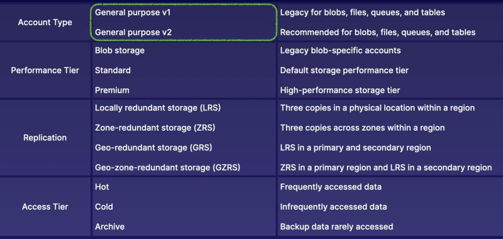

# how to use this document
* create a login to notebooklm.google.com (I prefer notebooklm over other interfaces, but it's up to you)
* upload this as a source
* use the notebook guide and produce the five prompts given

## summary Azure Resource Manager
* resources are azure managed entities, like VMs, storage accounts, VNets
* understand resource hierarchy

## summary azure portal and cloud shell
* login via Entra ID identity
* CRUD azure resoruces 
* manage azure via cloud shell
* manage billing
* log support tickets

## summary Azure CLI and Powershell
* azcli and powershell can:
  * manage azure resources locally (including in azure cloudshell)
  * create scripts for automation
  * no need to log in to the Azure portal

## summary ARM templates
* ARM templates are Declarative JSON (IaC)
* quickly deploy repeatable and modular envs
  * you can call other ARM templates from ARM templates

## summary Subscriptions
* subscriptions:
  * billing unit that aggregates all costs of underlying resources
  * contain resource groups and associated resources
* scoping level for governance and security
* can be associated with a single organization Entra ID tenant at a time

## summary using management groups
* mgmt groups provide hierarchy of management
* root management group access is not given by default
* root management group can't be moved or seletec
* Azure RBAC is supported for mgmt groups
* Global Administrators must be elevated to USer Access Administrator of root group.
  * temporarily assign this role only

## summary Understanding Azure Policy
* Azure Policy applies governance
  * create manage and assign policies.
  * Can be used to enforce (you can deny creation of resources outside of compliance) or audit compliance on resources.
* Policy components:
  * policy definition
  * policy assignment
* Many policies can be combined:
  * Initiative definition: can scope many definitions

## summary tagging resources
* tags (name/value pairs) can be used to:
  * manage resources
    * shutting down all VMs via a tag, or enforce policy, or billing
* tags are not inherited, but can be via Azure Policy

## summary Logging and moving resources
* resource lock types:
  * `ReadOnly`: allows authed users to resource, but can not delete or update resource (ie: you can't power off a VM... you can't affect state at all!)
  * `CanNotDelete`: allows authed users to read and modify a resource, but can't delete. (ie: you can't delete a VM)
* there is inheritance for locks

## summary managing azure costs
* pricing calc: how much will resources cost us to run at given spec
* TCO calc: analyze on-prem workloads and obtain costs
* Microsoft Cost Management: analyze costs, create budget

## summary building a cloud governance strategy with azure tool

* management groups/subscription/resource group hierarchy
* policies are used to control
* (RBAC) role assignment to resource groups
* locks

## summary Identity in Azure
* Azure AD / Entra ID
  * IAM basics
  * define Entra ID
  * Entra ID tenant
  * Entra ID architecture
  * compare Entra ID with legacy AG
  * Create and switch between tenants
* Entra ID Users
  * define users, types of users, methods of creating users, architecture
  * create and delete users
  * perform bulk user updates
  * invite guest accounts
* Entra ID groups
  * define groups, group and membership types, RBAC
  * create dynamic groups
  * assign access to resources
* Entra ID join:
  * define Entra ID Join, device settings and conditional access
  * join Windows 10 to Entra ID
* Administrative units:
  * Define MFA and self-service password reset (SSPR)
  * enable MFA
  * enable SSPR

## summary conceptualizing Entra ID
* Entra ID
  * Tenant is the organization instance
* purposes:
  * IAM: global cloud-baed identity service for Azure that provides an identity repo.
  * Create identity resources: create users and groups.
  * Manage identity security: enable conditional access policies, control resource access and provide policy-based controls across all Azure resource instances and management functions.

## summary managing tenants
* Entra ID tenant is within your region
* inside the tenant all identity resources exist

## summary creating and managing users
* Entra ID tenant users and groups exist
* types of users: admins, member, guests
* Role assignment: determines perms and access
* Object ownership: apps, devices, groups and resources that are owned

## summary creating and managing groups
* group types:
  * security groups: are used to manage access to shared resources for a group of users
  * M365 gorups: used to give members access to shared mailbox, calendar, files, etc
* Membership types:
  * assigned: static group membership
  * dynamic user: logic based given user properties
  * dynamic device: created that automate group membership via device attributes.

## summary Creating administrative units
* purpose of administrative units: an Entra ID resource for providing a container for Entra ID objects.
* allow you to control the scope of your administrative users.
* Use case: administrative units based on geographical locations, business departments, or subsidiary organizations of a parent organization.

## summary configure self-service password reset (SSPR)
* SSPR:
  * unauthed users use SSPR
  * decreases admin overhead
  * securre password reset for users and admins

## summary Entra ID Device management
* device identity: gives devices identities so that the devices can access resources in Entra ID
  * simplified procedure for adding and managing devices
  * improve user experienc on devices
  * SSO for any registrered or joined

## summary understanding roles in Azure
* Azure (RBAC) roles:
  * managing access to Azure `resources`
  * scope can be at multiple levels
  * supports custom roles
  * has a few role types
  * scope at management groups, subscriptions, resource groups, and resources
* Entra ID roles
  * manage access to Entra ID resources within Entra ID tenant
  * scope is at tenant level
  * supports custom roles
  * has a few role types
  * Administrative Units can help with scoping

## summary Assigning access to resources
* Azure RBAC == authorization system to provide access to Azure resources
* implicit deny -> explicit allow -> explicit deny
* roles are cumulative/additive, Azure heirarchy inheritance applies

## summary Creating custom roles
* custom roles
  * provide identities with access to azure resources or Entra ID objects
  * roles are collection of permissions
  * scoping hiearchy for role assignments
  * custom role definitions are JSON and should be based on built-in roles
  * create a custom role when there are no built-in role that meets your requirements
  * to create a custom role, you must have `User Access Administrator` or `Owner` role for the account

## summary Understanding Storage Accounts

* `General purpose v2` is generally suggested

## summary conceptualizing azure blob storage
* blob service is object storage
* blob containers store blobs
* blob containers provide a flat-file structure

## summary configuring blob object replication
* enabling blob container repl requires
  * Versioning: on both source and dest storage accounts, must be enabled
  * change feed: on source storage account, must be enabled.
* repl policies: a single storage account can be a soruce for up to two dst accounts.  EAch policy supports only a single pairing using a policy ID.
* cross subscription and Entra ID tenant blob object repl is supported.

## summary configuring blob lifecycle management
* storage accounts requirement: support General Purpose v2 and blob storage accounts
* types and subtypes: support block and append blobs, and support subtypes: base blobs, snapshots, and version
* filtering: filter blobs in the rule using prefix or blob index matches
* scoping: scope at the storage account level or limit blobs by filters
* if/then logic applies in lifecycle rules based on mod and access times.

## summary configuring azure files
* managed file share service: utilizes storage account redudancy and security
* OS clients: Windows, linux and macOS
* protocol support: SMB, REST, NFS
* File shares can have quotes, default is 5TB

## summary configuring azure File Sync
* Azure File Sync:
  * extends on-prem file share: increases storage capacity through cloud tiering
  * Windows only: windows 2012 R2 or later file servers only
  * Requires File Sync Agent: download Azure File Sync agent onto local file server

## summary storage network access
* private network access, each sub-service has an endpoint
* endpoints have a:
  * public endpoint
  * restricted access
  * private endpoint

## summary securing storage accounts
* storage accounts are encrypted default encryption with keys managed by microsoft
* you can secure the management and data layer
  * using access keys
  * using SAS
  * using Entra ID authentication (RBAC)

## summary Using Azure Jobs
* move large amounts of data between on-prem and Azure Storage in case there isn't enough bandwidth, etc
* Import jobs: send large amounts of data to the Azure cloud when network bandwidth won't support data migration
* Export jobs: receive large amounts of data on-prem from azure cloud when entwork bandwidth won't support data migration (for BLOBs)
* WAImportExport CLI tool: use to prepare disks for data and to estimate number of disks needed.
* Windows support only
* Azure Blob and Files

## summary Storage utilties (storage explorer vs. AzCopy)
* storage explorer
  * manage storage accounts
  * use Entra ID or SAS to auth
  * gui provided
  * uses AzCopy under the hood
* azcopy
  * manage storage accounts
  * use Entra ID or SAS to auth
  * CLI tool == scripting capabilities

## summary Conceptualizing Virtual Networks
* purpose of a network: a network allows a client to have an isolated network where resoruces cna communicate with one another and with outside networks
* isolated network: VNets are isolated networks on the Azure cloud (SDN)
* private network access: provides private connectivity between resources like VMs or App Services
* network integration: allows connectivity between VNets, on-prem networks and remote user devices

## summary creating virtual networks
* default connectivity: by default, intra-network traffic and outbound internet traffic is allowed
* addres restrictions: use of private addr using RFC1918.  The smallest vnet subnet size is /29, largest /8
* reserved IPs: x.x.x.[0-3] and x.x.x.255
* DNS and DHCP are provided: but DNS can be customized
* network integration: VNets are built for integration with one another, hybrid connectivity using VPNs and ExpressRoute
* VNet protocol support: TCP, UDP, ICMP

## summary deploying network resources
* network interface cards have:
  * private ip and public ip
* private IPs: static or dynamic assigned addr that allow private connectivity between resources
* public IPs: static or dynamic assigned addr that allow public connectivity **from** the internet to a resource
  * basic SKU: static or dynamic assigned public IP that is **accessible by default** and requires an NSG to restrict traffic.  Does not support availabiity zone deployment
  * Standard SKU: statically assignable public IP that is **not accessible by default** and rquires an NSH to allow traffic.  Supports AZ deployment

## summary routing VNets
* system routes: default route that are built-in to virtual networks that cannot be modified
* custom routes: user-defined routes or BGP routes that override system routes.
* order of precedence:
  * custom routes (highest)
  * BGP
  * system routes (lowest)

## summary Network Security Groups
* network security groups control traffic
* NSGs are stateful
* NSG are used for
  * filter traffic: determining what trafic will be allowed or denied inbound and outbound
  * association: must be associated to suybnet or NIC
  * rules: evaling default rules that cannot be deleted and user-defined rules that can be created
  * priority: specifying priority to roder the precedence of rules.  the lower the number, the higher the priority
    * user defined rules can use priority nubmers of 100-4096
  * there must be effective access flow... remember NSGs are bound to subnet (inter-subnet including internet) and/or NIC (east-west)

## summary Using Azure DNS
* features:
  * RBAC (this wasn't covered :) )
  * activity logs (this wasn't covered :) )
  * resource locking (this wasn't covered :) )
  * private DNS zone
  * alias records

## summary using azure firewall
* create a new subnet called `AzureFirewallSubnet`, and create a /26
* must create a route
* options for rules:
  * Nat rules
  * NEtwork rules
  * Application rules

## summary using service endpoints
* using service endpoints, you can enable private connectivity to your serivces
  * decreases attack surface
  * enables use of NSG rules
  * enhanced routing

## summary Using Private Endpoints
* a private endpoint provides
  * a private IP for your connected services
  * connectivity to Azure services
  * connectivity to customer/partner services
  * direct service (Sub-resoruce) mapping

## summary configuring azure VNet peering
* types of peerings
  * virtual network peerings
  * global virtual network peering
* benefits:
* low latency, high bandwidth connections (MSFT backbone)
* cross-network comms
* data transfer between/across subscriptions, Entra ID tenants via Azure roles, azure regions
* transitivity: peering connections are non-transitive
* reciprocity: peering connections are not reciprocal

## summary Implementing VPNs
* Config steps:
  * create VNets and Subnets
  * specify the DNS server
  * create GatewaySubnet
  * Create the VPN Gateway
  * Create a Local NEtwork Gateway
  * Configure the VPN device on prem
  * Create the VPN connection
* connections options
  * VNet-to-VNet
  * Site-to-Site
  * Point-to-Site

## summary Configure ExressRoute
* Azure ExpressRoute
  * dedicated physical connection
    * partners offer PoPs in data centers
  * built-in redundancy
  * connectivity to MSFT
  * connectivity via private peering (Azure resources)
  * dynamic routing via BGP
  * 50Mbps-10Gbps

## summary implementing Virtual WAN
* azure Virtual WAN
  * single operational interface where we manage fully manage networks
  * Connect networks using hub-spoke architecture
  * basic (S2S VPN connections only) and standard SKUs
  * connect S2S and P2S VPN gateways, global reach ExpressRoute, and VNets
  * secure with Azure Firewlal and Firewall Manager
  * Any-to-any connectivity
  * Connections propagated to managed routes
  * Hubs are Managed Virtual Networks

## summary creating and managing VMs
* VMs provide OS instances, are compute resources
* allows migrate workloas
* compute resources are elastic

## summary Managing VM disks
* Azure Disks are VHD
* OS disk, temporary disk, data disk
  * disks are stored as page blobs
* SSE == physical encryption on disks
* ADE == key based encryption for data

## summary configuring VM scale sets
* HA: design highly avialable solutions using zonal redudant deployment
* Availability Sets: provide protection for redundant VMs by preventing outagesw related to faults and updates by logically groupign them into domains
* scale sets: autoscale solutions to meet demands of traffic and scale in to decrease costs when demand goes down

## summary Automating VM deployments
* ARM template: deploy VM squickly and manage infrastructure using change control using IaC
* VHD template: create a golden image of VMs to easily deploy VMs with consistent software and configs
* Automation mgmt: manage VM deployments using custom data and manage VMs using extension scripts

## summary Managing Virtual Machine Updates
* Automation Account: service for managign update configs for VMs
* Hybrid Runbook Worker: runbook for updates and configs that will be run
* Log Analytics workspace: storage for logging details about update mgmt process
* Log Analytics Agent: agent installed on OS instance for sending back data to workspace

## summary Automating VM configs
* Automation acocunt: service for managing update configs for VMs
* Powershell DSC: powershell scripts that declare desired state of VMs
* Local Configuration Manager: sends current config state to pull server for eval

## summary Using Azure Bastion
* bastion is used to access VMs
* private traffic: traffic from Bastion to target VM stays within VNets (peer Vnets included)
* Hardened bastion: NSGs are not needed because bastion is hardened internally
* Service Integration: bastion natively integraze with Azure Firewall
* Concurrent connections: max 25 RDP and 50 SSH simultaenously
* Audit logs: enable diagnostics for auditing Bastion connections
* Required roles: `Reader` role perms are required on the Bastion, VM, and NIC in order to use Bastion

## summary Introducing Azure Load Balancer
* load balancing: balance traffic between external or internal solutions
* health probing: health check ports for nodes in backend pool
* DNAT: port forward inbound traffic to nodes in the backend pool
* SNET: port forward outbound traffic from nodes in the backend pool
* Availability zones: determine AZ selection for deployment

## summary Using Application Gateway
* load balancing: balance traffic between backend pools using HTTP/HTTPS
* SSL termination: terminate TLS/SSL at the app gateway
* url routing: url path-based routing between multiple backend pools (multiple web sites running on a single public IP)
* security: WAF security for the LB solution
* autoscaling: scale up/down the backend pools for the app gateway

## summary creating an app service plan
* app service plans: a plan that defines compute resources and available features for a web app
* app service plan compute resources: dependant: pricing tier, size of VM instances, number of VM instances and region
* app service plan compute types: shared, dedicated, and isolated, each provides a different level of compute isolation, netowkr isolation, and features like scaling.
* app serviec plans and web apps: provides PaaS to config and host apps rather than infra.  Manage a few config details to run a web app

## summary creating web apps
* application runtime: host and app iusing a specific runtime that is select as part of the provisioning process
* public accessibility: Web apps are publicly accessible by default, and can be accessed usign the domain provided to you by Azure
* publishing tools: publish your app code to web apps using various publishing tools, including Azure DevOps, GitHub,zip file, SCM, etc
* database support: connect your DB to your web app using a connection string

## summary configuring web apps
* scaling: limited by pricing tier and compute type
* deployment: used for staging applications for a swap
* network: Web App is public by default and can be deployed into or integrated with a VNet
* Backup: blob backups of app configs, file contents and DB connection strings

## summary describing containers in Azure
* development: create and build a container so it can be shipped
* registry: manage a container registry of container images in a single place (Azure Container Registry)
* Azure Container Instances (ACI): docker container hosting platform

## summary Using Azure Monitor
* Metrics:
  * Metrics are gathere on a per-resource basis
  * to use metrics:
    * view metrics in Metrics Explorer
    * Query in Log Analytics
    * Alert and take action
    * export and archive
* Logs:
  * logs are not gathered by default iby the Azure platform
  * to use logs:
    * query in Log Analytics
    * archive
    * strema to third party
* Diagnostic Settings:
  * Define how and where metrics and logs will be stored on a per-resource basis
    * OS level data
    * app level data

## summary setting up alerting and actions
* use data to trigger alerts
  * alert rules
  * scoped to resources
  * consider conditions
  * then can take actions

## summary configure Azure Monitor logs
* azure Monitor Logs aggregate to a Log Analytics Workspace
* within Log Analytics workspace: visualize, alert, gain insights
* data sources:
  * Internal data: azure resources, Entra ID tenant, and subscriptions
  * External data: on prem resources in hybrid env
* Log Analytics Agent: an extension installed on resources to allow for telemtry to be gathered into the workspace

## summary Understanding Monitor Insights
* Azure Monitor services:
  * VM Insights: VMs and VMSS-specific services
  * NEtworks
  * Containers
  * App Insights

## summary Configuring Application Insights
* Application Insights is a full stack monitoring solution that can gather a lot of data client and server side and stream in near-real time to an aggregated destination
* runtime instrumentation: codeless approach with Application Insights, no package implementation
* Built-time instrumentation: coded approach with Application Insights, package implemented via SDK
* Instrumentation key: key for implementing instrumentation in applciations (this key is stored in Application Insights resources)

## summary using Network Watcher
* network watcher can be implemented per region
* Monitoring Tools:
  * topology: view a diagram of the resources in VNet
  * connection Monitor: monitor conenctivity between Azure resources (and on-prem networks)
  * Network Performance Monitor: monitor network perf and connectivity between VNets, datacenter, and/or ExpressRoute from centralized location
* Diagnostic tools:
  * IP Flow Verify: test if traffic is allowed or denied inbound or outbound from VMs
  * Next hop: determine how traffic hops from VM to dst
  * effective security rules: determine effective security rules on a NIC
  * packet capture: capture packets to and/or from a VM for analysis
  * Connection tshoot: determine connectivity between src and dst VMs
  * VPN diags: diag and tshoot VNet gateway issues

## summary Understanding Disaster Recovery
* Disaster recovery methods
  * backup: a copy of business critical data
  * cold site: a copy of critical infra that needs preparation before DR is complete
  * hot site: a copy of crit infra and data that is ready to be swapped in as the prod workload

## summary Configuring Azure Backup
* workloads: azure VMs, on prem workloads, SQL server workloads, SAP HANA workloads
* Recovery services fault: storage mgmt for all backup data.
* Azure Backup: cloud-managed backup service for configing backup frequency and retention

## summary Azure Site Recovery
* create DR solutions to repl to a primary location to a secondary locations
  * Replicate Items: workload that will be repled site-to-site by Azure Site Recovery
  * Replication Policy: defines the frequency of snapshots and retention period of recovery points.  CAn be app-consistent or crash-consistent
  * Recovery plan: automate and run test failover events with protected itemss and pre- and/or post-scripts

## summary backup reports
* backup reports capture backup related operations to understand cloud storage usage
* Log Analytics Workspace and the settings in the Recovery Services Vault
* backup reports contain:
  * backup policies
  * backup jobs
  * backup items
  * summary of estate